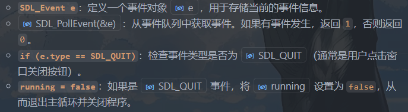
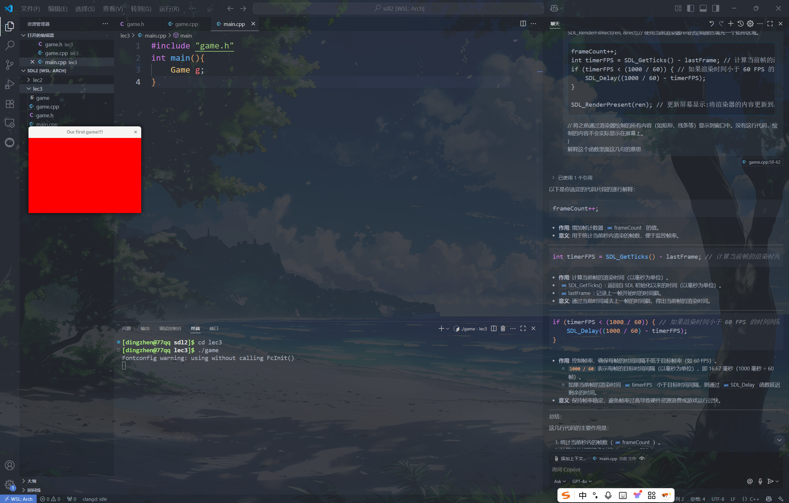
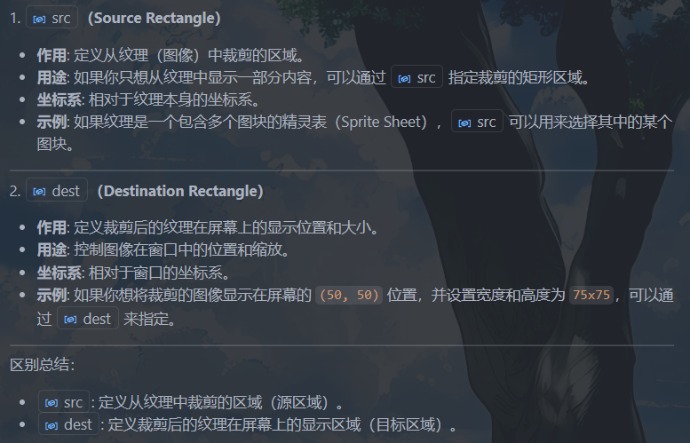
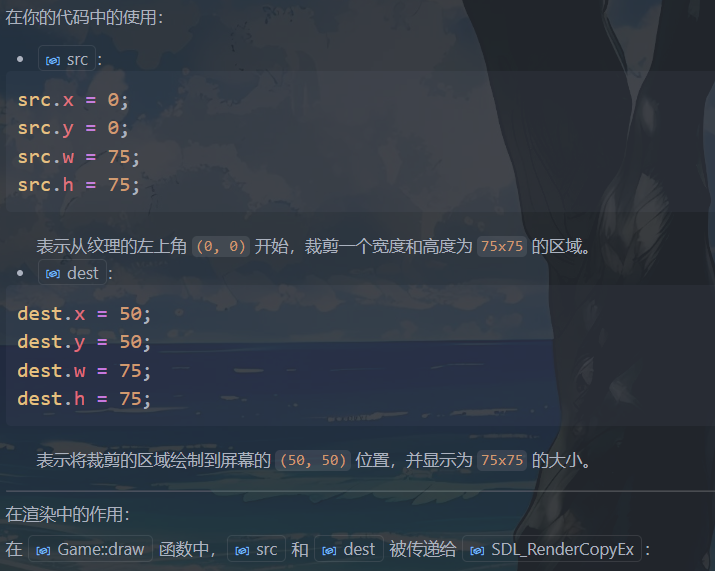
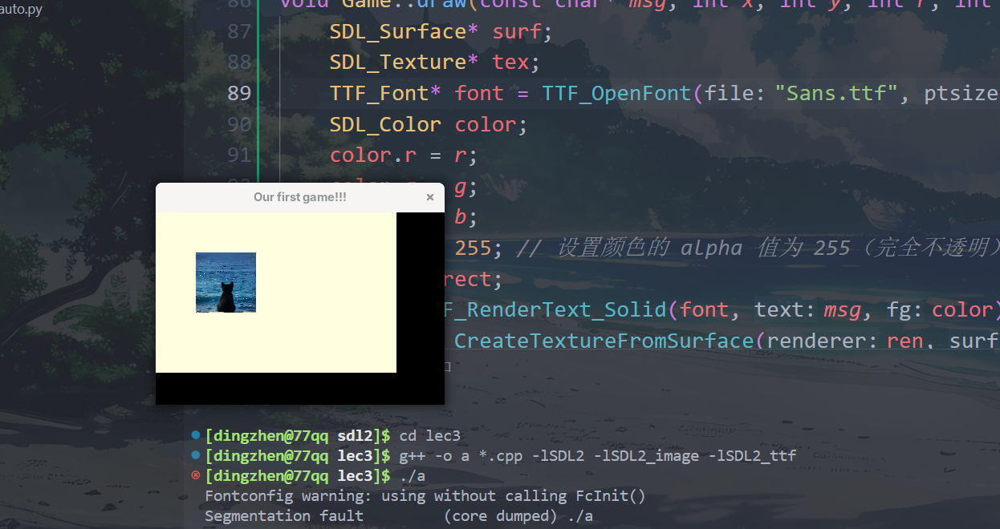
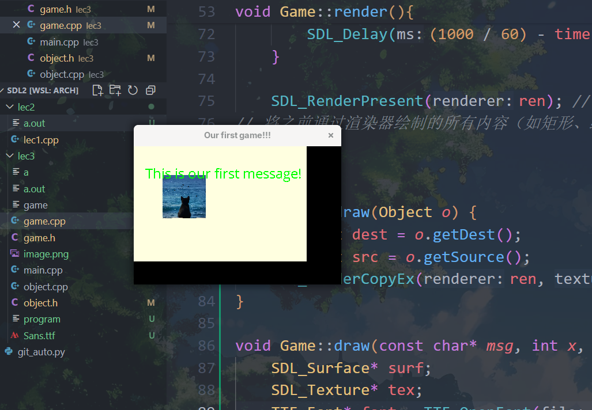

[C++ SDL2 Window Tutorial](https://www.youtube.com/watch?v=c5UEFzOJ9-U&list=PLVotA8ycjnCs3DNWIbEIpBrjYkhJq11q-&index=2)

编译命令：
```shell
 g++ -o a *.cpp -lSDL2 -lSDL2_image -lSDL2_ttf
```
## lec2: FPS, Keyboard, Fullscreen
```cpp
#include <SDL2/SDL.h>
#include <iostream>

#define WIDTH 1280
#define HEIGHT 720

bool running, fullscreen;
SDL_Renderer* renderer;
SDL_Window* window;
int frameCount, timerFPS, lastFrame, fps;


void update() {
    if (fullscreen) SDL_SetWindowFullscreen(window, SDL_WINDOW_FULLSCREEN);
    if (!fullscreen) SDL_SetWindowFullscreen(window, 0);
}

void input() {
    SDL_Event e;
    while (SDL_PollEvent(&e)) {
        if (e.type == SDL_QUIT) running = false;
    }
    const Uint8* keystates = SDL_GetKeyboardState(NULL);
    if (keystates[SDL_SCANCODE_ESCAPE]) running = false;
    if (keystates[SDL_SCANCODE_F11]) fullscreen =!fullscreen;
}

void draw() {
    SDL_SetRenderDrawColor(renderer, 40, 43, 200, 255);
/*
作用: 设置渲染器的绘制颜色。
参数 (40, 43, 200, 255) 分别表示 红色 (R)、绿色 (G)、蓝色 (B) 和 透明度 (A)。
这里设置的颜色是一个蓝色调（RGB 值为 40, 43, 200），完全不透明（A = 255）。
*/
    SDL_Rect rect;
    rect.x = rect.y = 0; // 矩形的左上角坐标为 (0, 0)，即窗口的左上角。
    rect.w = WIDTH;
    rect.h = HEIGHT;
    SDL_RenderFillRect(renderer, &rect);

    frameCount++;
    int timerFPS = SDL_GetTicks() - lastFrame;
    if (timerFPS < (1000 / 60)) {
        SDL_Delay((1000 / 60) - timerFPS);
    }

    SDL_RenderPresent(renderer);
}

int main() {
    running = 1;
    fullscreen = 0;
    static int lastTime = 0;
    if (SDL_Init(SDL_INIT_EVERYTHING) < 0) 
    //参数: SDL_INIT_EVERYTHING:这是一个宏，表示初始化 SDL 的所有子系统（如视频、音频、计时器等）。
        std::cout << "Failed at SDL_Init()" << std::endl;
    if (SDL_CreateWindowAndRenderer(WIDTH, HEIGHT, 0, &window, &renderer) < 0) //指向 SDL_Window* 的指针，用于存储创建的窗口。
        std::cout << "Failed at SDL_CreateWindowAndRenderer()" << std::endl; //指向 SDL_Renderer* 的指针，用于存储创建的渲染器。
    
    SDL_SetWindowTitle(window, "SDL2 Window");
    SDL_ShowCursor(1);
    SDL_SetHint(SDL_HINT_RENDER_SCALE_QUALITY, "2");//用于设置 SDL 渲染器的缩放质量提示。
/*
"0"：最近邻算法（Nearest Pixel Sampling），速度快，但质量低。
"1"：线性插值（Linear Filtering），质量较高。
"2"：各向异性过滤（Anisotropic Filtering），质量最高。
*/
    while (running) {
        lastFrame = SDL_GetTicks();
        if (lastFrame >= (lastFrame + 1000)) { 
            lastTime = lastFrame;
            fps = frameCount;
            frameCount = 0;
        }
        std::cout << fps << std::endl;

        update();
        input();
        draw();
    }

    SDL_DestroyRenderer(renderer);
    SDL_DestroyWindow(window);
    SDL_Quit();

    return 0; 
}
```

解析：
### 事件处理（键盘鼠标点击）
```cpp
void input() {
    SDL_Event e;
    while (SDL_PollEvent(&e)) {
        if (e.type == SDL_QUIT) running = false;
    }
    const Uint8* keystates = SDL_GetKeyboardState(NULL);
    if (keystates[SDL_SCANCODE_ESCAPE]) running = false;
    if (keystates[SDL_SCANCODE_F11]) fullscreen =!fullscreen;
}
```


`const Uint8* keystates = SDL_GetKeyboardState(NULL);`获取当前键盘的状态，返回一个指向键盘状态数组的指针。数组中的每个元素表示对应按键的状态（按下为 1，未按下为 0）。
因为只有两个状态所以只需要8为无符号int

## lec3: Window & Gameloop
**关于FPS：** Frames Per Second，表示每秒钟渲染或显示的画面帧数，反映了游戏或图形程序运行的流畅程度。

常见的 FPS 范围：
30 FPS: 基本流畅，适合一些低要求的游戏或动画。
60 FPS: 流畅的体验，常见于大多数现代游戏。
120 FPS 或更高: 超高流畅度，适合高端显示器和硬件。


??? note "game.cpp"
    ```cpp
    // game.cpp
    # include "game.h"
    #include <SDL2/SDL.h>
    #include <SDL2/SDL_render.h>
    Game::Game() {
        SDL_Init(0);
        SDL_CreateWindowAndRenderer(360, 240, 0, &win, &ren);
        SDL_SetWindowTitle(win, "Our first game!!!");
        running = true;
        count = 0;
        loop(); 
    }

    Game::~Game() {
        SDL_DestroyRenderer(ren);
        SDL_DestroyWindow(win);
        SDL_Quit();
    }

    void Game::loop() {
        while (running) {

    /*
    frameCount: 用于记录当前秒内渲染的帧数。
    timerFPS: 用于计算当前帧的渲染时间。ms
    lastFrame: 用于记录上一次渲染的时间戳，ms

    */
            lastFrame = SDL_GetTicks();// ms
            static int lastTime;
            if(lastFrame >= (lastTime + 1000)) {
                lastTime = lastFrame;
                frameCount = 0;
                count++;
            }
            render();
            input();
            update();

            if(count > 3) running = false; // 运行3秒后退出
            
        }
    }


    void Game::render(){
        SDL_SetRenderDrawColor(ren,255,0,0,255);
        /*
    255, 0, 0: 表示颜色的 RGB 值，这里是红色（R=255，G=0，B=0）。
    255: 表示颜色的 alpha 值（透明度），255 表示完全不透明。
        */
        SDL_Rect rect;
        rect.x = 0; // 矩形的左上角 x 坐标
        rect.y = 0; // 矩形的左上角 y 坐标
        rect.w = 360; // 矩形的宽度
        rect.h = 240; // 矩形的高度
        SDL_RenderFillRect(ren, &rect);//  使用当前渲染器ren的绘制颜色填充一个矩形区域。

        frameCount++;
        int timerFPS = SDL_GetTicks() - lastFrame; // 计算当前帧的渲染时间。ms
        if (timerFPS < (1000 / 60)) { // 如果渲染时间小于 60 FPS 的时间间隔，则延迟以保持帧率。
            SDL_Delay((1000 / 60) - timerFPS);
        }

        SDL_RenderPresent(ren); // 更新屏幕显示:将渲染器的内容更新到屏幕上。
    // 将之前通过渲染器绘制的所有内容（如矩形、线条等）显示到窗口中。没有这行代码，绘制的内容不会实际显示在屏幕上。
    }

    ```

??? note "game.h"
    ```cpp
    // game.h
    #ifndef GAME_H
    #define GAME_H

    #include <SDL2/SDL.h>

    #include <iostream>
    using namespace std;

    class Game{
    public:
        Game();
        ~Game();
        void loop();
        void update(){}
        void input(){}
        void render();
    private:
        SDL_Renderer* ren;
        SDL_Window* win;
        bool running;
        int count;// 记录游戏运行的秒数
        int frameCount , timerFPS , lastFrame;
    /*
    frameCount: 用于记录当前秒内渲染的帧数。
    timerFPS: 用于计算当前帧的渲染时间。ms
    lastFrame: 用于记录上一次渲染的时间戳，ms

    */
    };


    #endif // GAME_H
    ```

??? note "main.cpp"
    ```cpp

    // main.cpp
    #include "game.h"
    int main(){
        Game g;
    }
    ```

运行效果：



## lec4: Objects and Drawing

### 像素（pixels）
这里所有坐标的单位都是**像素（pixels）**

!!! note "像素&分辨率"

    === "像素"

        像素（**Pixel**，来自“Picture Element”）是**数字图像的最小单位**。


        一个像素 = 图像中一个点

        它表示一张图片上最小的**颜色单位**，就像马赛克的一个格子。

        举个例子：

        * 一张 **1920 × 1080** 的图片有 1920 个横向像素、1080 个纵向像素；
        * 总共像素数 = 1920 × 1080 = 2,073,600 像素（即“200万像素”）。


        **🔍 像素包含什么内容？**

        每个像素记录一个颜色，通常包括：

        * **RGB 值**：红（Red）、绿（Green）、蓝（Blue）的组合；

        * 比如 (255, 0, 0) 表示纯红色；
        * 有时还包含 **透明度（Alpha 值）**，比如在 PNG 格式中。

        ---

        🖼 举例说明：

        一张小图（3×2）：

        |    |    |    |
        | -- | -- | -- |
        | 🔴 | 🔵 | ⚪  |
        | ⚫  | 🟢 | 🔴 |

        这是一个 **3像素宽 × 2像素高** 的图像，共 6 个像素，每个小图标相当于一个像素。

        ---

        **🧠 像素 ≠ 实际尺寸（比如厘米）**

        图像实际显示的大小还取决于：

        * **分辨率（如 72 DPI, 300 DPI）**
        * **显示设备的密度（像素/英寸）**

        比如：

        * 同样是 500 像素宽的图片，在手机屏幕上看起来比在大显示器上小。


    === "分辨率"

        **分辨率**指的是图像或屏幕上**水平方向和垂直方向的像素数量**，表示图像的“清晰度”或“细节程度”。

        ---

        🧩 分辨率的定义：

        分辨率 = **宽 × 高**

        举例：

        | 分辨率         | 说明               | 总像素数量               |
        | ----------- | ---------------- | ------------------- |
        | 800 × 600   | 老式显示器的常见分辨率      | 480,000 像素          |
        | 1920 × 1080 | 全高清（Full HD）     | 2,073,600 像素（约200万） |
        | 3840 × 2160 | 4K 超高清（Ultra HD） | 8,294,400 像素（约800万） |


        **📺 两种常见场景下的分辨率解释：**

        1. **屏幕分辨率**（显示设备）

        指的是屏幕上能显示多少像素，比如你的电脑或手机屏幕。

        * 一台 **1920×1080** 的显示器，屏幕可以横向显示 1920 个像素，纵向显示 1080 个像素。
        * 分辨率越高，图像越细腻，但如果屏幕不够大，字体可能会显得很小。

        👉 所以分辨率和\*\*屏幕尺寸（英寸）\*\*配合使用，才决定你看到的大小。


        2. **图像分辨率**（图片文件）

            指的是图片本身包含多少像素，常见于照片、截图。

            * 一张 **3000×2000** 的照片，共有 600 万个像素（6MP）；
            * 如果打印，通常还会配合 **DPI（每英寸像素点数）** 使用来控制打印大小。

        🧠 拓展：分辨率 ≠ 清晰度？

        不完全等价：

        * **分辨率高** → 细节多，理论上更清晰；
        * 但若屏幕太小、压缩严重、对比度差，依然可能看不清。


        > **分辨率是衡量图像或屏幕能显示多少像素的指标，格式为“宽 × 高”。它影响图像的细节程度。**


而file指令可以查看图片属性
```
[dingzhen@77qq lec3]$ file image.png
image.png: JPEG image data, Exif standard: [TIFF image data, big-endian, direntries=4, width=0, height=0, orientation=upper-left], baseline, precision 8, 997x983, components 3
```

- 997x983: 表示图片的像素大小，宽度为 997 像素，高度为 983 像素。
- JPEG image data: 表示图片的格式是 JPEG。
- components 3: 表示图片有 3 个颜色通道（通常是 RGB）。


定义`object`类

```cpp 
class Object {
private:
    SDL_Rect dest;// 定义裁剪后的纹理在屏幕上的显示位置和大小。位置和缩放
    SDL_Rect src;// 从纹理（图像）中裁剪的区域
    SDL_Texture* tex;
public:
    Object(){}
    SDL_Rect getDest() const { return dest; }
    SDL_Rect getSource() const { return src; }
    void setDest(int x, int y, int w, int h) ;
    void setSource(int x, int y, int w, int h) ;
    void setImage(string filename , SDL_Renderer* ren);
    SDL_Texture* getTex() const { return tex; }
};

```





最后的渲染效果：



### SDL_Surface/Texture/Renderer* 

!!! example "SDL_Surface* 和 SDL_Texture* 和 SDL_Renderer* "
    在 SDL 中，`SDL_Surface`、`SDL_Texture` 和 `SDL_Renderer` 是图形渲染的核心组件，它们各自有不同的用途，并且相互关联。以下是它们的用法和在程序中的关联解释：

    === "1. SDL_Surface"
        #### 1. SDL_Surface
        用法:

        - `SDL_Surface` 是一种未优化的图像数据结构，通常存储在 CPU 内存中。 
        - 它主要用于加载图像文件或创建临时的图像数据。 
        - 适合在加载图像或进行像素级操作时使用，但不适合直接渲染到屏幕上。 

        常用函数:

        - **加载图像**:
        ```cpp
        SDL_Surface* surf = IMG_Load("image.png");
        ```
        在你的程序中:
        ```cpp
        SDL_Surface* surf = IMG_Load(filename.c_str());
        ```
        这句代码将图像文件加载为 `SDL_Surface`，以便后续转换为纹理。(只支持C风格字符串)

        - **释放内存**:
        ```cpp
        SDL_FreeSurface(surf);
        ```
        在将 `SDL_Surface` 转换为 `SDL_Texture` 后，应释放 `SDL_Surface`，以节省内存。 

    === "2. SDL_Texture"
        #### 2. SDL_Texture
        用法:

        - `SDL_Texture` 是一种优化后的图像数据结构，存储在 GPU 内存中。 
        - 它是从 `SDL_Surface` 转换而来的，适合高效地渲染到屏幕上。 
        - 纹理是通过 `SDL_Renderer` 渲染到窗口中的。 

        常用函数:

        - **从 `SDL_Surface` 创建纹理**:
        在你的程序中:
        ```cpp
        SDL_Texture* tex = SDL_CreateTextureFromSurface(renderer, surf);
        ```
        这句代码将 `SDL_Surface` 转换为 `SDL_Texture`，以便通过渲染器绘制到屏幕上。
        - **释放纹理**:
        ```cpp
        SDL_DestroyTexture(tex);
        ```
        在不需要纹理时，应释放它以避免内存泄漏。 

    === "3. SDL_Renderer"
        #### 3. SDL_Renderer
        用法:

        - `SDL_Renderer` 是一个渲染器，用于将纹理绘制到窗口上。 
        - 它是图形渲染的核心，负责管理绘制操作。 

        常用函数:

        - **创建渲染器**:
        ```cpp
        SDL_CreateWindowAndRenderer(360, 240, 0, &win, &ren);
        ```
        在你的程序中，这句代码在`Game::Game`构造函数中，同时创建了窗口和渲染器。
        - **设置绘制颜色**:
        ```cpp
        SDL_SetRenderDrawColor(renderer, 255, 0, 0, 255);
        ```
        这句代码在`Game::render`函数中，
        设置渲染器的绘制颜色。
        - **绘制纹理**:

            简单情形
            ```cpp
            SDL_RenderCopy(renderer, texture, &src, &dest);
            ```
            在你的程序中:（复杂情形，需要旋转翻转等操作）
            ```cpp
            SDL_RenderCopyEx(ren, o.getTex(), &src, &dest, 0, NULL, SDL_FLIP_NONE);
            ```
            这句代码在 `Game::draw` 函数中，
            将纹理绘制到屏幕上，`src` 是裁剪区域（可以为NULL表示无需要任何裁剪），`dest` 是目标显示区域。`0:` 旋转角度（以度为单位）。`NULL`: 旋转中心点（默认为目标矩形的中心）。`SDL_FLIP_NONE`: 不进行翻转（可以设置为水平翻转或垂直翻转）。
            
        - **更新屏幕**:
        ```cpp
        SDL_RenderPresent(renderer);
        ```
        这句代码在`Game::render`函数中，将所有绘制操作更新到屏幕上。 


#### 关联关系
1. **从 `SDL_Surface` 到 `SDL_Texture`**:
    - `SDL_Surface` 是从图像文件加载的原始数据。 
    - 使用 `SDL_CreateTextureFromSurface` 将其转换为 `SDL_Texture`，以便通过 GPU 高效渲染。 
2. **通过 `SDL_Renderer` 渲染 `SDL_Texture`**:
    - `SDL_Texture` 是与 `SDL_Renderer` 关联的。 
    - 使用 `SDL_RenderCopy` 或 `SDL_RenderCopyEx` 将纹理绘制到屏幕上。 
3. **在你的程序中的流程**:
    - 加载图像 
    - 转换为纹理 
    - 释放表面 
    - 通过渲染器绘制纹理 

- `SDL_Surface`：用于加载和存储未优化的图像数据，存储在 CPU 内存中。 
- `SDL_Texture`：用于高效渲染的优化图像数据，存储在 GPU 内存中。 
- `SDL_Renderer`：负责将纹理绘制到窗口上，是渲染的核心。 

在你的程序中，这三者的关系如下：

1. 使用 `IMG_Load` 加载图像为 `SDL_Surface` 。 
2. 使用 `SDL_CreateTextureFromSurface` 将 `SDL_Surface` 转换为 `SDL_Texture` 。 
3. 使用 `SDL_Renderer` 将 `SDL_Texture` 绘制到窗口上。 


## lec4: Rendering Font 
https://www.fontsquirrel.com/fonts/open-sans

下载`OpenSans-Regular.ttf`重命名为`Sans.ttf`粘贴在根目录下

在`game.h`中`class game`类中新添加函数draw
```cpp
void draw(const char* msg, int x, int y, int r, int g, int b, int size);
```


```cpp "game.cpp"
void Game::draw(const char* msg, int x, int y, int r, int g, int b, int size) {
    SDL_Surface* surf;
    SDL_Texture* tex;
    TTF_Font* font = TTF_OpenFont("Sans.ttf", size);
    SDL_Color color;
    color.r = r;
    color.g = g;
    color.b = b;
    color.a = 255; // 设置颜色的 alpha 值为 255（完全不透明）
    SDL_Rect rect;
    surf = TTF_RenderText_Solid(font, msg, color);
    tex = SDL_CreateTextureFromSurface(ren, surf);
    rect.x = x;
    rect.y = y;
    rect.w = surf->w;
    rect.h = surf->h;
    SDL_FreeSurface(surf);
    SDL_RenderCopy(ren, tex, NULL, &rect);
    SDL_DestroyTexture(tex);
}
```
并且在`game.cpp`的`Game`类的构造函数和析构函数中分别加上字体库的行为
```cpp
TTF_Init(); // 初始化字体库
TTF_Quit(); // 退出字体库
```
添上`#include <SDL2/SDL_ttf.h>`,编译时候加上`-lSDL2_ttf`链接库


渲染效果：


## lec5: Input Method