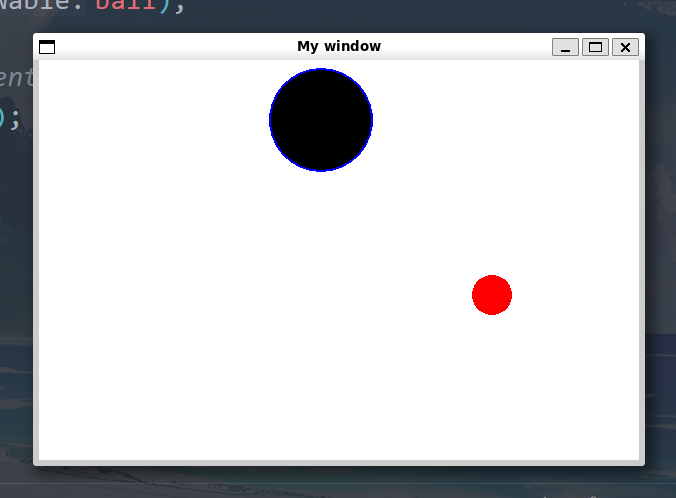
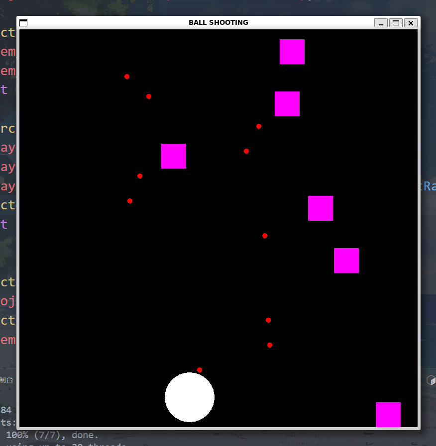
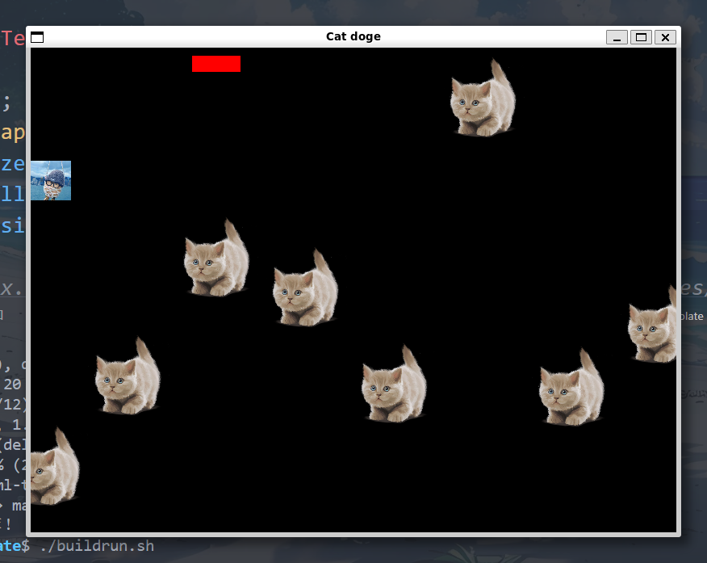

# sfml learning
https://www.sfml-dev.org/tutorials/2.6/

直接使用 g++ 编译时没有链接SFML库，所以应该要
```shell
g++ main.cpp -o a -lsfml-graphics -lsfml-window -lsfml-system
```

替代方案：使用CMake构建
```shell
cmake_minimum_required(VERSION 3.28)
project(CMakeSFMLProject LANGUAGES CXX)

set(CMAKE_RUNTIME_OUTPUT_DIRECTORY ${CMAKE_BINARY_DIR}/bin)

include(FetchContent)
FetchContent_Declare(SFML
    GIT_REPOSITORY https://github.com/SFML/SFML.git
    GIT_TAG 2.6.1
    GIT_SHALLOW ON
    EXCLUDE_FROM_ALL
    SYSTEM)
FetchContent_MakeAvailable(SFML)

add_executable(main src/main.cpp)
target_compile_features(main PRIVATE cxx_std_17)
target_link_libraries(main PRIVATE SFML::Graphics)

```

CMakeLists.txt 文件当前使用了 FetchContent 来下载 SFML 源码。如果网络延迟较高导致卡住，可以改为直接使用系统安装的 SFML（通过 apt 安装的 2.6.1 版本）。以下是修改后的 CMakeLists.txt 文件：

```shell
cmake_minimum_required(VERSION 3.28)
project(CMakeSFMLProject LANGUAGES CXX)

set(CMAKE_RUNTIME_OUTPUT_DIRECTORY ${CMAKE_BINARY_DIR}/bin)

# 使用系统安装的 SFML
find_package(SFML 2.6 REQUIRED COMPONENTS graphics window system)

add_executable(main src/main.cpp)
target_compile_features(main PRIVATE cxx_std_17)

# 链接到系统安装的 SFML 库
target_link_libraries(main PRIVATE sfml-graphics sfml-window sfml-system)
```


```shell
# 进入build目录
cd ~/newfolder/build

# 编译项目
make

# 运行程序
./MySFMLGame
```


## 基操
[youtube教程跟练](https://www.youtube.com/watch?v=ClNJVYJ-aI8&list=PL6xSOsbVA1eaJnHo_O6uB4qU8LZWzzKdo&index=5)
### Tutorial 02 | Creating a window, using events and the game-loop

最基本框架：

!!! note "框架"
    ```cpp
    #include <iostream>
    #include <SFML/Window.hpp>
    #include <SFML/System.hpp>
    #include <SFML/Graphics.hpp>

    using namespace sf;
    using namespace std;

    int main()
    {
        // create the window
        RenderWindow window(VideoMode(800, 600), "My window");
        window.setFramerateLimit(60); // limit the frame rate to 60 FPS

        // run the program as long as the window is open
        while (window.isOpen())
        {
            // check all the window's events that were triggered since the last iteration of the loop
            Event event;
            while (window.pollEvent(event))
            {
                // "close requested" event: we close the window
                if (event.type == Event::Closed)
                    window.close();
            }

            // clear the window with black color
            window.clear(Color::Black);

            // draw everything here...
            // window.draw(...);

            // end the current frame
            window.display();
        }

        return 0;
    }
    ```
    每次循环完成后，屏幕内容会更新一次，这就是一帧。程序会持续运行这个循环，生成连续的帧，从而实现动画或实时交互。

    `while (window.pollEvent(event))`是一个事件队列


最后程序：
```cpp
#include <iostream>
#include <SFML/Window.hpp>
#include <SFML/System.hpp>
#include <SFML/Graphics.hpp>


using namespace sf;
using namespace std;

int main()
{
    // create the window
    RenderWindow window(VideoMode(800, 600), "My window");
    window.setFramerateLimit(60); // limit the frame rate to 60 FPS
    CircleShape circle(50.f); // create a circle shape
    circle.setFillColor(Color::Yellow); // set the circle color to yellow
    circle.setPosition(375.f, 275.f); // set the circle position to the center of the window

    // run the program as long as the window is open
    while (window.isOpen())
    {
        // check all the window's events that were triggered since the last iteration of the loop
        Event event;
        while (window.pollEvent(event))
        {
            // "close requested" event: we close the window
            if (event.type == Event::Closed)
                window.close();
        }
        circle.move(0.1f, 0.1f); // move the shape slightly to the right
        // clear the window with black color
        window.clear(Color::White);

        // draw everything here...
        // window.draw(...);
        window.draw(circle); // draw the circle shape
        // end the current frame
        window.display();
    }

    return 0;
}
```


### Tutorial 03 | Circles and Rectangles and such
```cpp
#include <iostream>
#include <SFML/Window.hpp>
#include <SFML/System.hpp>
#include <SFML/Graphics.hpp>


using namespace sf;
using namespace std;

int main()
{
    // create the window
    RenderWindow window(VideoMode(800, 600), "My window");
    window.setFramerateLimit(60); // limit the frame rate to 60 FPS
    CircleShape circle(50.f); // create a circle shape
    circle.setFillColor(Color::Yellow); // set the circle color to yellow
    circle.setPosition(100.f, 100.f); // set the circle position to the center of the window

    RectangleShape rect(Vector2f(50.f, 100.f));
    rect.setFillColor(Color(100, 100, 100, 255));
    rect.setPosition(400.f, 400.f);


    // run the program as long as the window is open
    while (window.isOpen())
    {
        // check all the window's events that were triggered since the last iteration of the loop
        Event event;
        while (window.pollEvent(event))
        {
            // "close requested" event: we close the window
            if (event.type == Event::Closed)
                window.close();
        }
        circle.move(0.1f, 0.1f); // move the shape slightly to the right
        circle.rotate(2.f);
        rect.move(-0.1f, -0.1f); // move the rectangle slightly to the right
        rect.rotate(2.f);
        // clear the window with black color
        window.clear(Color::White);

        // draw everything here...
        // window.draw(...);
        window.draw(circle); 
        window.draw(rect);
        // end the current frame
        window.display();

    }

    return 0;
}
```

### Tutorial 04 | Triangles, lines and convex shapes
```cpp
#include <iostream>
#include <SFML/Window.hpp>
#include <SFML/System.hpp>
#include <SFML/Graphics.hpp>

using namespace sf;
using namespace std;

int main()
{
    
    // create the window
    RenderWindow window(VideoMode(800, 600), "My window");
    window.setFramerateLimit(60); // limit the frame rate to 60 FPS

    CircleShape triangle(100.f, 3); // create a triangle shape
    triangle.setFillColor(Color::Green); // set the fill color to green
    triangle.setPosition(300, 200); // set the position of the triangle


    Vertex line[] = {Vertex(Vector2f(100, 400)),
                     Vertex(Vector2f(50, 100))};
    // run the program as long as the window is open

    ConvexShape convex;
    convex.setPointCount(5);
    convex.setPoint(0, Vector2f(0, 0));
    convex.setPoint(1, Vector2f(150, 10));
    convex.setPoint(2, Vector2f(120, 90));
    convex.setPoint(3, Vector2f(30, 100));
    convex.setPoint(4, Vector2f(0, 50)); 
    convex.setFillColor(Color::Red); // set the fill color to red
    convex.setPosition(0, 0); // set the position of the convex shape

    while (window.isOpen())
    {
        // check all the window's events that were triggered since the last iteration of the loop
        Event event;
        while (window.pollEvent(event))
        {
            // "close requested" event: we close the window
            if (event.type == Event::Closed)
                window.close();
        }

        // clear the window with black color
        window.clear(Color::Black);

        // draw everything here...
        // window.draw(...);
        window.draw(triangle); // draw the triangle
        window.draw(line, 2, Lines); // draw the line
        window.draw(convex); // draw the convex shape
        // end the current frame
        window.display();
    }

    return 0;
}
```

### Tutorial 05 | Keyboard and Mouse input intro and Events
```cpp
#include <iostream>
#include <SFML/Window.hpp>
#include <SFML/System.hpp>
#include <SFML/Graphics.hpp>

using namespace sf;
using namespace std;

int main()
{
    // create the window
    RenderWindow window(VideoMode(800, 600), "My window");
    window.setFramerateLimit(60); // limit the frame rate to 60 FPS

    // run the program as long as the window is open
    while (window.isOpen())
    {
        // check all the window's events that were triggered since the last iteration of the loop
        Event event;
        while (window.pollEvent(event))
        {
            // "close requested" event: we close the window
            if (event.type == Event::Closed)
                window.close();
            // if (event.type == Event::KeyPressed && event.key.code == Keyboard::Escape)
            //     window.close(); // close the window when Escape is pressed
        }
        if (Keyboard::isKeyPressed(Keyboard::Escape)) 
            window.close(); // close the window when Escape is pressed
        
        if (Mouse::isButtonPressed(Mouse::Left))
            window.close(); // close the window when left mouse button is pressed

        // clear the window with black color
        window.clear(Color::Black);

        // draw everything here...
        // window.draw(...);

        // end the current frame
        window.display();
    }

    return 0;
}
```

### Tutorial 06 | Simple game using WASD and Mouse
```cpp
#include <SFML/Graphics/RectangleShape.hpp>
#include <SFML/Graphics/RenderWindow.hpp>
#include <SFML/Window/Mouse.hpp>
#include <SFML/Window/VideoMode.hpp>
#include <iostream>
#include <SFML/Window.hpp>
#include <SFML/System.hpp>
#include <SFML/Graphics.hpp>

using namespace sf;
using namespace std;

void Update(int &keyTime,RectangleShape &square,RenderWindow &window);
void Draw(RenderWindow &window,RectangleShape &square);


int main()
{
    int keyTime = 8;
    RenderWindow window(VideoMode(680,480), "Simple Square Swag");
    window.setFramerateLimit(60);

    RectangleShape square(Vector2f(100.f, 100.f));
    square.setFillColor(Color::Red);
    square.setPosition(window.getSize().x/2, window.getSize().y/2); // Center the square in the window


    while (window.isOpen())
    {
        // check all the window's events that were triggered since the last iteration of the loop
        Event event;
        while (window.pollEvent(event))
        {
            if (event.type == Event::Closed)
                window.close();
            if(event.type == Event::KeyPressed && event.key.code == Keyboard::Escape)
                window.close();
        }


        Update(keyTime, square, window);
        Draw(window,square);


    }
    return 0;
}


void Update(int &keyTime, RectangleShape &square, RenderWindow &window){
    if(keyTime < 8){// 用来限制点击切换方块颜色的时间间隔，不然会抽风反复切换，在连续几帧都检测到鼠标左键点击状态
        keyTime++;
        return;
    }
    if(Keyboard::isKeyPressed(Keyboard::A) && square.getPosition().x > 0){
        square.move(-5.f, 0.f);

    }
    if(Keyboard::isKeyPressed(Keyboard::D) && square.getPosition().x < window.getSize().x - square.getSize().x){
        square.move(5.f, 0.f);

    }
    if(Keyboard::isKeyPressed(Keyboard::W) && square.getPosition().y > 0){
        square.move(0.f, -5.f);

    }
    if(Keyboard::isKeyPressed(Keyboard::S) && square.getPosition().y < window.getSize().y - square.getSize().y){
        square.move(0.f, 5.f);

    }
    if(Mouse::isButtonPressed(Mouse ::Left) && keyTime >= 8){
        keyTime = 0; // 重置计时器
        if(square.getFillColor() == Color::Green)
            square.setFillColor(Color::Red);
        else
            square.setFillColor(Color::Green);
    }

}
void Draw(RenderWindow &window, RectangleShape &square){
    window.clear(Color::White);
    window.draw(square);
    window.display();
}
```

注意这里帧率和keyTime的配合

### Tutorial 07 | Simple shoot-the-target game with mouse and collision
```cpp
#include <SFML/Graphics/CircleShape.hpp>
#include <iostream>
#include <SFML/Window.hpp>
#include <SFML/System.hpp>
#include <SFML/Graphics.hpp>

using namespace sf;
using namespace std;

int main()
{
    // create the window
    RenderWindow window(VideoMode(600, 400), "My window");
    window.setFramerateLimit(60); // limit the frame rate to 60 FPS

    CircleShape hoop;
    int dir = 0;
    hoop.setRadius(50.f);
    hoop.setFillColor(Color::Black);
    hoop.setOutlineThickness(2);
    hoop.setOutlineColor(Color::Blue);
    hoop.setPosition(Vector2f(0,10.f));

    CircleShape ball;
    bool isShot = false;
    ball.setRadius(20.f);
    ball.setFillColor(Color::Red);
    ball.setPosition(Vector2f(0, window.getSize().y - ball.getRadius()*3));

    // run the program as long as the window is open
    while (window.isOpen())
    {
        // check all the window's events that were triggered since the last iteration of the loop
        Event event;
        while (window.pollEvent(event))
        {
            // "close requested" event: we close the window
            if (event.type == Event::Closed)
                window.close();
        }

        // Update hoop 
        if(hoop.getPosition().x <= 0)
            dir = 1;
        else if (hoop.getPosition().x + hoop.getRadius()*2 >= window.getSize().x)
            dir = 0;


        if(dir == 1){
            hoop.move(8.f, 0.f);
        } else {
            hoop.move(-8.f, 0.f);
        }

        //Update ball 
        if(Mouse::isButtonPressed(Mouse::Left))
            isShot = true;

        if(!isShot)
            ball.setPosition(Mouse::getPosition(window).x - ball.getRadius(), window.getSize().y - ball.getRadius()*3);
        else
            ball.move(0.f, -5.f);

        //Collision ball
        if(ball.getPosition().y <= 0 || ball.getGlobalBounds().intersects(hoop.getGlobalBounds())){
            isShot = false;
            //ball.setPosition(Vector2f(0, window.getSize().y - ball.getRadius()*3));
        }


        window.clear(Color::White);

        // draw everything here...
        window.draw(hoop);
        window.draw(ball);

        // end the current frame
        window.display();
    }

    return 0;
}
```




### Tutorial 08 | Shooter game with many projectiles and enemies!
```cpp
#include <SFML/Graphics/CircleShape.hpp>
#include <SFML/Graphics/RectangleShape.hpp>
#include <SFML/System/Vector2.hpp>
#include <iostream>
#include <vector>
#include <cstdlib>
#include <SFML/Window.hpp>
#include <SFML/System.hpp>
#include <SFML/Graphics.hpp>

using namespace sf;
using namespace std;

int main()
{
    srand(time(NULL));
    // create the window
    RenderWindow window(VideoMode(800, 800), "BALL SHOOTING");
    window.setFramerateLimit(60); // limit the frame rate to 60 FPS


    CircleShape projectile;
    projectile.setRadius(5.f);
    projectile.setFillColor(Color::Red);

    RectangleShape enemy;
    enemy.setFillColor(Color::Magenta);
    enemy.setSize(Vector2f(50.f,50.f));
    int enemySpawnTimer = 0;

    CircleShape player;
    player.setFillColor(Color::White);
    player.setRadius(50.f);
    player.setPosition(window.getSize().x / 2 - player.getRadius(), window.getSize().y - player.getRadius() * 2 - 10.f);
    Vector2f playerCenter ;
    int shootTimer = 0;


    vector<CircleShape> projectiles;
    projectiles.push_back(projectile);
    vector<RectangleShape> enemies;
    enemies.push_back(enemy);


    while (window.isOpen())
    {
        Event event;
        while (window.pollEvent(event))
        {
            // "close requested" event: we close the window
            if (event.type == Event::Closed)
                window.close();
        }

//player
    
        playerCenter = player.getPosition() + Vector2f(player.getRadius(), player.getRadius());
        if(shootTimer < 5){
            shootTimer++;
        }
        player.setPosition(Mouse::getPosition(window).x - player.getRadius(), player.getPosition().y);

//projectile
        if(Mouse::isButtonPressed(Mouse::Left) && shootTimer >= 5){
            projectile.setPosition(playerCenter);
            projectiles.push_back(projectile);

            shootTimer = 0;
        }

        for(size_t i = 0; i < projectiles.size(); i++){
            projectiles[i].move(0.f, -10.f);
            if(projectiles[i].getPosition().y <= 0){
                projectiles.erase(projectiles.begin() + i);
            }
        }

//enemy
        if(enemySpawnTimer < 20){
            enemySpawnTimer++;
        } 
        else {
            enemy.setPosition(rand() % (window.getSize().x - (int)enemy.getSize().x), 0.f);
            enemies.push_back(enemy);
            enemySpawnTimer = 0;
        }
        for(size_t i = 0; i < enemies.size(); i++){
            enemies[i].move(0.f, 5.f);
            if(enemies[i].getPosition().y >= window.getSize().y){
                enemies.erase(enemies.begin() + i);
            }

        }
//collision detection
        if(!projectiles.empty() && !enemies.empty()){
            for(size_t i = 0; i < enemies.size(); i++){
                for(size_t k = 0;k < projectiles.size();k++){
                    if(enemies[i].getGlobalBounds().intersects(projectiles[k].getGlobalBounds())){
                        enemies.erase(enemies.begin() + i);
                        projectiles.erase(projectiles.begin() + k);
                        break;
                    }
                }
            }
        }


        // clear the window with black color
        window.clear(Color::Black);

        // draw everything here...
        window.draw(player);

        for (const auto& enemy : enemies)
            window.draw(enemy);
        for (const auto& projectile : projectiles)
            window.draw(projectile);

        // end the current frame
        window.display();
    }

    return 0;
}

```



### Tutorial 09 | TEXTURES and SPRITES | Cats do(d)ging game with health bar
```cpp

#include <SFML/Graphics/RectangleShape.hpp>
#include <SFML/Graphics/Sprite.hpp>
#include <iostream>
#include <SFML/Window.hpp>
#include <SFML/System.hpp>
#include <SFML/Graphics.hpp>

using namespace sf;
using namespace std;

int main()
{
    srand(time(NULL));
    RenderWindow window(VideoMode(800, 600), "Cat doge");
    window.setFramerateLimit(60); // limit the frame rate to 60 FPS


//CAT
    Texture catTex;
    Sprite cat;
    int hp = 10;
    RectangleShape hpBar;
    hpBar.setSize(Vector2f((float)hp * 20.f, 20.f));
    hpBar.setFillColor(Color::Red);
    hpBar.setPosition(200.f, 10.f);

    //if(!catTex.loadFromFile("/home/man567/code/sfml-template/Textures/cat.png"))
    if (!catTex.loadFromFile("Textures/cat11.png"))
        throw "Could not load cat texture";

    cat.setTexture(catTex);
    cat.setScale(0.1f, 0.1f); // scale the cat sprite to half its size

    vector<Sprite> cats;
    cats.push_back(cat);
    int catSpawnTimer = 20;

//DOGE
    Texture dogeTex;
    Sprite doge;

    if (!dogeTex.loadFromFile("Textures/doge.png"))
        throw "Could not load doge texture";

    doge.setTexture(dogeTex);
    doge.setScale(0.04f, 0.04f); // scale the doge sprite to half its size

//GAME LOOP
    while (window.isOpen() && hp > 0) // game loop runs while the window is open and the player has health
    {
        // check all the window's events that were triggered since the last iteration of the loop
        Event event;
        while (window.pollEvent(event))
        {
            // "close requested" event: we close the window
            if (event.type == Event::Closed)
                window.close();
            if( event.type == Event::KeyPressed && event.key.code == Keyboard::Escape) // if the escape key is pressed
            {
                window.close(); // close the window
            }
        }
//UPDATE
//cat(enemies)
        for(size_t i = 0; i < cats.size(); ++i)
        {
             cats[i].move(-10.f, 0.f); // move each cat sprite slightly
            if(cats[i].getPosition().x < 0 - cats[i].getGlobalBounds().width) // if the cat goes off screen
            {
                cats.erase(cats.begin() + i); // remove the cat if it goes off screen
            }
        }
        if(catSpawnTimer < 10)
        {
            catSpawnTimer++;
        }
        else
        {
            cat.setPosition(window.getSize().x, rand() % int(window.getSize().y - cat.getGlobalBounds().height)); // spawn at a random height
            cats.push_back(cat);
            catSpawnTimer = 0;
        }


//DOGE(player)
        doge.setPosition(doge.getPosition().x, Mouse::getPosition(window).y);
        if(doge.getPosition().y < 0) // if the doge goes off screen
        {
            doge.setPosition(doge.getPosition().x, 0); // set the doge's position to the top of the screen
        }
        if(doge.getPosition().y > window.getSize().y - doge.getGlobalBounds().height) // if the doge goes off screen
        {
            doge.setPosition(doge.getPosition().x, window.getSize().y - doge.getGlobalBounds().height); // set the doge's position to the top of the screen
        }

//COLLISION
        for(size_t i = 0; i < cats.size(); ++i)
        {
            if(cats[i].getGlobalBounds().intersects(doge.getGlobalBounds())) // if the cat collides with the doge
            {   
                hp--;
                cats.erase(cats.begin() + i); // remove the cat
                 
            }
        }


//UI
        hpBar.setSize(Vector2f((float)hp * 20.f, 20.f));

//DRAW
        window.clear(Color::Black);
        window.draw(doge);
        for(size_t i = 0; i < cats.size(); ++i)
        {
            window.draw(cats[i]);
        }
        window.draw(hpBar);
        window.display();
    }

    return 0;
}
```



### Tutorial 10 | 2D shooter game with 360 degree shooting! Made easy with vectors
