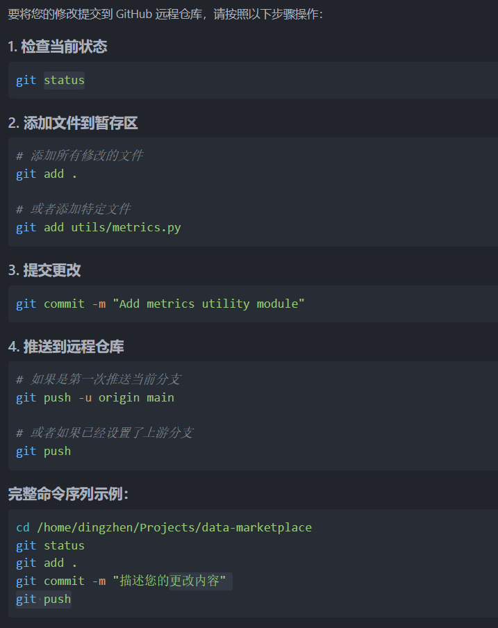

# Git

很好！你已经在 GitHub 创建了仓库：[zhuiluozhiji/short-term-project](https://github.com/zhuiluozhiji/short-term-project)。接下来我们来**一步步指导你将本地项目结构搭建好并推送到该仓库中**，以便小组成员协作开发。


---

## ✅ 目标

我们要将如下项目结构上传到该仓库中：

```
short-term-project/
├── README.md
├── requirements.txt
├── .gitignore
├── LICENSE
├── data/
├── models/
│   └── learner.py
├── market/
│   ├── auction.py
│   ├── pricing.py
│   └── revenue.py
├── utils/
│   └── metrics.py
└── main.py
```

---

## 🧭 步骤一：本地创建目录结构（命令行方式）

在你希望放置项目的目录下运行以下命令（推荐用终端或 WSL）：

```bash
# Step 1: 克隆远程仓库
git clone https://github.com/zhuiluozhiji/short-term-project.git
cd short-term-project

# Step 2: 创建目录结构
mkdir -p data models market utils

# Step 3: 创建初始化文件
touch README.md requirements.txt .gitignore LICENSE main.py
touch models/learner.py
touch market/auction.py market/pricing.py market/revenue.py
touch utils/metrics.py
```

> 📌 如果你是 Windows 用户，不用 WSL，也可以手动在资源管理器中创建这些目录和文件。

---


## 🧭 步骤三：提交并推送到 GitHub


首次推送时候的设置：
``` bash
# 改用 SSH 推送（高级用户）
git remote set-url origin git@github.com:zhuiluozhiji/short-term-project.git
```


如果已经添加过远程，运行前可以先用以下命令检查：

```bash
git remote -v
```
---

在 `short-term-project/` 目录下运行：

```bash
git add .
git commit -m "Initialize project structure and base files"
git push origin main
```

---

## 🧑‍🤝‍🧑 步骤四：添加协作者（组员）

1. 打开 [仓库设置](https://github.com/zhuiluozhiji/short-term-project/settings)
2. 左侧菜单栏 → **Collaborators**
3. 搜索你组员的 GitHub 用户名 → 点击 “Add”

他们会收到一封邮件，接受邀请后就能协作开发了。

---

### ✅ 后续建议

| 模块      | 谁负责  | 建议分支名                     |
| ------- | ---- | ------------------------- |
| 数据模拟    | A 组员 | `feature/data-gen`        |
| 拍卖与机制设计 | B 组员 | `feature/auction`         |
| MWU定价   | C 组员 | `feature/mwu-pricing`     |
| 收益分配    | D 组员 | `feature/shapley-revenue` |

每人开发完 → Pull Request → 审核合并到 `main`。

---

首次推送时候的设置：
``` bash
# 改用 SSH 推送（高级用户）
git remote set-url origin git@github.com:zhuiluozhiji/short-term-project.git
```


如果已经添加过远程，运行前可以先用以下命令检查：

```bash
git remote -v
```

## 之后的更改仅需要的操作


远程仓库 main 分支已经有提交（如：README.md），而你本地的 main 分支是空的或没有这些提交，所以你直接推送被拒绝了。

**✅ 解决方案：先拉取远程内容（合并或重建历史）
拉取远程并合并（推荐）
保持远程历史，适合你希望保留远程已有文件：**
``` bash
git pull --rebase origin main
git pull origin main
```

