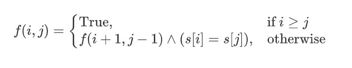

# Leetcode

---

??? note

    Lorem ipsum dolor sit amet, consectetur adipiscing elit. Nulla et
    euismod nulla. Curabitur feugiat, tortor non consequat finibus, justo
    purus auctor massa, nec semper lorem quam in massa.

```cpp
#include <iostream>
using namespace std;
//others 
int main() {
    return 0;
}
```

=== "Python"

    ```py
    def main():
        print("Hello world!")
    
    if__name__ == "__main__":
        main()
    ```

=== "JavaScript"

    ```js
    function main() {
        console.log("Hello world!");
    }
    
    main();
    ```

---

## 2.18 leetcode100-回溯-全排列


以下是答案的解法，已经将时间复杂度优化到最佳

```cpp
class Solution {
    public:
    void backtrack(int first,int len,vector<int>& output,vector<vector<int>> &res){
        //表示我将数组坐标为first-1及其之前的元素全部排好固定了，接下来要排好index为first及其之后的所有数后将所有的结果放入res容器,并且全部操作完之后要求output容器中的元素次序与调用该次backtrack前的次序严格不变
        if(first == len){
            res.emplace_back(output);
            return;
        }
        for(int i = first;i <= len-1;i++){
            swap(output[i],output[first]);
            backtrack(first+1,len,output,res);
            swap(output[i],output[first]);
        }
    }
    vector<vector<int>> permute(vector<int>& nums) {
        vector <vector<int>> res;
        backtrack(0,(int)nums.size(),nums,res);
        return res;
    }
};
```

以下展示我的解法：比较原始，就是新建一个 v 数组来记录使用了哪一些数，

!!! note
    函数形参中 vector 要的带&

```cpp
class Solution {
    public:
	void backtrack(vector<int> &v,vector<vector<int>> &res,vector<int> &output,vector<int> &nums,int first){//即将塞进索引为first的位置
        if(first == nums.size()){
            res.push_back(output);
            return;
        }
        for(int i = 0;i < nums.size();i++){
            if(v[i] == 0){
                output.push_back(nums[i]);
                v[i] = 1;
                backtrack(v,res,output,nums,first + 1);
                output.pop_back();
                v[i] = 0;
            }

        }
    }
    vector<vector<int>> permute(vector<int>& nums) {
        vector<vector<int>> res;
        vector<int> v(nums.size(),0);
        vector<int> output;
        backtrack(v,res,output,nums,0);
        retur
      
    }
};
```

## 2.18 leetcode100-回溯-子集


我写的解法：

```cpp
class Solution {
public:
    vector<vector<int>> subsets(vector<int>& nums) {
        vector<vector<int>> res;
        vector<int> output;
        backtrack(res,output,nums,0);
        return res;

    }
    void backtrack(vector<vector<int>> &res,vector<int> &output,vector<int> &nums,int first){
        //index first is to be done 会在output的基础上，将first及其之后的所有子集可能放到res里面,,output讨论了索引为first-1及其之前的所有数,并且output调用前后保持不变
        if(first == nums.size()){
            res.emplace_back(output);
            return;
        }
        output.emplace_back(nums[first]);
        backtrack(res,output,nums,first + 1);
        output.pop_back();
        backtrack(res,output,nums,first + 1);
    }

};
```

??? tip
    优化：由于 res 数组和 output 都是两个函数都在使用的，所以直接定义到 public 内的变量，不需要在递归函数中反复传递（因为你已经确保 output 容器在 backtrack 调用前后保持不变）类似“全局”的变量？

=== "优化前"

```cpp
```cpp
class Solution {
public:
    vector<vector<int>> subsets(vector<int>& nums) {
        vector<vector<int>> res;
        vector<int> output;
        backtrack(res,output,nums,0);
        return res;

    }
    void backtrack(vector<vector<int>> &res,vector<int> &output,vector<int> &nums,int first){
        //index first is to be done 会在output的基础上，将first及其之后的所有子集可能放到res里面,,output讨论了索引为first-1及其之前的所有数,并且output调用前后保持不变
        if(first == nums.size()){
            res.emplace_back(output);
            return;
        }
        output.emplace_back(nums[first]);
        backtrack(res,output,nums,first + 1);
        output.pop_back();
        backtrack(res,output,nums,first + 1);
    }

};
```
```

=== "优化后"

```cpp

class Solution {
    public:
    vector<vector<int>> res;
    vector<int> output;
    vector<vector<int>> subsets(vector<int>& nums) {
        backtrack(nums,0);
        return res;

    }
    void backtrack(vector<int> &nums,int first){
        //index first is to be done 会在output的基础上，将first及其之后的所有子集可能放到res里面,,output讨论了索引为first-1及其之前的所有数,并且output调用前后保持不变
        if(first == nums.size()){
            res.emplace_back(output);
            return;
        }
        output.emplace_back(nums[first]);
        backtrack(nums,first + 1);
        output.pop_back();
        backtrack(nums,first + 1);
    }

};

```

## 2.19 leetcode100-回溯-电话号码字母组合


```cpp
class Solution {
public:
    vector<string> makedir(){
        vector<string> dir(10,"");
        dir[2] = "abc";
        dir[3] = "def";
        dir[4] = "ghi";
        dir[5] = "jkl";
        dir[6] = "mno";
        dir[7] = "pqrs";
        dir[8] = "tuv";
        dir[9] = "wxyz";
        return dir;

    }
    void putin(string output,string ranks,int pos,vector<string> &result,vector<string> &dir){//index pos to be filled给定一个数字顺序，输出所有的字母排序，pos开始
        if(pos == ranks.length()){
            result.emplace_back(output);
        //    cout << "push " << output << " in" << endl;
            return;
        }
        int dirnum = ranks[pos] - '0';  
        string dirr = dir[dirnum];//abc
        for(char ch : dirr){
            output.push_back(ch);
            putin(output,ranks,pos+1,result,dir);
            output.pop_back();
        }
    }
    vector<string> letterCombinations(string digits) {
        vector<string> null;
        if(digits.empty()){
            return null;
        }
        vector<string> ranker;
        ranker = rank(digits);
//        cout << "ok" << endl;
        vector<string> result;
        vector<string> dir = makedir();
//        cout << "ok1 " << endl;
/*      for(auto itt = dir.begin();itt != dir.end();itt++){
            cout << *itt << " ";
        }
*/
        //cout << "final operation:" << endl;
/*        for(vector<string>::iterator it = ranker.begin();it != ranker.end();it++){//每一个数字组合
            string ranks = (*it);
            cout << ranks << endl;
            string output;
            putin(output,ranks,0,result,dir);
        }
*/      string output;
        string ranks =  digits;   
        putin(output,ranks,0,result,dir);
        return result;

    }
    void backtrack(string digits,int first,vector<string> &res){
        if(first == digits.length()){
            res.emplace_back(digits);
            return; 
        }
        for(int i = first;i < digits.length();i++){
            swap(digits[first],digits[i]);
            backtrack(digits,first + 1,res);
            swap(digits[first],digits[i]);
        }

    }
    vector<string> rank(string digits){//返回所有可能的数字组合
        vector<string> res;
        backtrack(digits,0,res);
 /*       for(auto it = res.begin();it != res.end();it++){
            cout << *it << endl;
        }
*/        return res;
    } 
};
```

因为没有认真看题，我以为电话号码数字组合是可以排序的 damn！！因此其实最初写的是这个全排列版本，what can i say 就当锻炼好了

```cpp
class Solution {
public:
    vector<string> makedir(){
        vector<string> dir(10,"");
        dir[2] = "abc";
        dir[3] = "def";
        dir[4] = "ghi";
        dir[5] = "jkl";
        dir[6] = "mno";
        dir[7] = "pqrs";
        dir[8] = "tuv";
        dir[9] = "wxyz";
        return dir;
    }
    void putin(string output,string ranks,int pos,vector<string> &result,vector<string> &dir){//index pos to be filled给定一个数字顺序，输出所有的字母排序，pos开始
        if(pos == ranks.length()){
            result.emplace_back(output);

            return;
        }
        int dirnum = ranks[pos] - '0';  
        string dirr = dir[dirnum];//abc
        for(char ch : dirr){
            output.push_back(ch);
            putin(output,ranks,pos+1,result,dir);
            output.pop_back();
        }
    }
    vector<string> letterCombinations(string digits) {
        vector<string> null;
        if(digits.empty()){
            return null;
        }
        vector<string> ranker;
        ranker = rank(digits);
        vector<string> result;
        vector<string> dir = makedir();

        for(vector<string>::iterator it = ranker.begin();it != ranker.end();it++){//每一个数字组合
            string ranks = (*it);
            cout << ranks << endl;
            string output;
            putin(output,ranks,0,result,dir);
        }

        return result;

    }
    void backtrack(string digits,int first,vector<string> &res){
        if(first == digits.length()){
            res.emplace_back(digits);
            return; 
        }
        for(int i = first;i < digits.length();i++){
            swap(digits[first],digits[i]);
            backtrack(digits,first + 1,res);
            swap(digits[first],digits[i]);
        }

    }
    vector<string> rank(string digits){//返回所有可能的数字组合
        vector<string> res;
        backtrack(digits,0,res);
        return res;
    } 
};
```

??? note
    const string &来代替 string： string 会进行复制操作，创建一个新对象，而 const string &不会进行复制操作，直接使用原来的对象，且不改变存储值 。函数形参里面不会变了 like ： string digits 也可以用 const string &digits

??? note
    可以用哈希表 unordered_map 来存数字字母对应表，使用.at(key)来找键值

答案的解法学习方式

```cpp
class Solution {
   public:
    vector<string> letterCombinations(string digits) {
        vector<string> combinations;
        if (digits.empty()) {
            return combinations;
        }
        unordered_map<char, string> phoneMap{
            {'2', "abc"},
            {'3', "def"},
            {'4', "ghi"},
            {'5', "jkl"},
            {'6', "mno"},
            {'7', "pqrs"},
            {'8', "tuv"},
            {'9', "wxyz"}
        };
        string combination;
        backtrack(combinations, phoneMap, digits, 0, combination);
        return combinations;
    }

    void backtrack(vector<string>& combinations, const unordered_map<char, string>& phoneMap, const string& digits, int index, string& combination) {
        if (index == digits.length()) {
            combinations.push_back(combination);
        } else {
            char digit = digits[index];
            const string& letters = phoneMap.at(digit);
            for (const char& letter: letters) {//auto is
                combination.push_back(letter);
                backtrack(combinations, phoneMap, digits, index + 1, combination);
                combination.pop_back();
            }
        }
    }
};

```

## 2.19 leetcode100-回溯-组合总和

my solution：

```cpp
class Solution {
public:
    vector<vector<int>> combinationSum(vector<int>& candidates, int target) {
        sort(candidates.begin(),candidates.end());
        vector<int> output;
        vector<vector<int>> res;
        backtrack(candidates,0,0,target,output,res);
        return res;
    }
    void backtrack(vector <int> &candidates,int pos,int cursum,int target,vector<int> &output,vector<vector<int>> &res){
        for(int i = pos;i < candidates.size();i++){
            if(cursum + candidates[i] > target){
                return;
            }
            output.emplace_back(candidates[i]);
            if(cursum + candidates[i] == target){
                res.emplace_back(output);
                output.pop_back();  
                continue;
            }
            backtrack(candidates,i,cursum + candidates[i],target,output,res); 
            output.pop_back();         
        }
      
  
    }
};
```

## 2.19 leetcode100-回溯-括号

```cpp
class Solution {
public:
    vector<string> generateParenthesis(int n) {
        vector<int> output;
        vector<vector<int>> res;
        backtrack(n,n,0,output,res);
        for(auto it = res.begin();it != res.end();it++){
            for(auto it1 = (*it).begin();it1 != (*it).end();it1++){
                cout << *it1 ;
            }
            cout << endl;
        }
        vector<string> result;
        result = trans(res);

        return result;
    }
    void backtrack(int left,int right,int sum,vector<int> &output,vector<vector<int>> &res){
        if(sum < 0){
            return;
        }
        if(left == 0){
            vector<int> output1 = output;
            for(int i = 0;i < right;i++){
                output1.emplace_back(1);
            }
            res.emplace_back(output1);
            return;
        }
        if(right == 0){
            res.emplace_back(output);
            return;
        }
        output.emplace_back(0);
        backtrack(left-1,right,sum + 1,output,res);
        output.pop_back();

        output.emplace_back(1);
        backtrack(left,right-1,sum - 1,output,res);
        output.pop_back();


    }
    vector<string> trans(vector<vector<int>> &res){
        vector<string> result;
      
        for(auto it = res.begin();it != res.end();it++){
            vector<int> rank = *it;
            string ele;
            for(auto it1 = rank.begin();it1 != rank.end();it1++){
                if(*it1 == 1){
                    ele.push_back(')');
                }
                else{
                    ele.push_back('(');
                }
              
            }
            result.emplace_back(ele);
        }
        return result;
    }
};


```

## 2.20 leetcode100-回溯-单词搜索

在修改数组越界的 bug 时花了不少时间，积攒经验 ing，还是怪我可怜的代码量呜呜

```cpp
class Solution {
public:
    bool exist(vector<vector<char>>& board, string word) {
        int row = board.size();
        int col = board[0].size();
        //cout << "row:" << row << ";col:" << col << endl;
        vector<vector<int>> use(row,vector<int>(col,0));
        for(int i = 0;i < row;i++){
            for(int j = 0;j < col;j++){
                //cout << "check(" << i << "," << j << "):" ;
                if(board[i][j] != word[0]){
                    continue;
                }
                use[i][j] = 1;
                if(backtrack(i,j,0,board,word,use) == 1){
                    //cout << "find：" << i << " " << j ;
                    use[i][j] = 0;
                    return true;
                  
                }
                use[i][j] = 0;
                //cout << endl;
            }
        }
        return false;
    }
    bool backtrack(int i,int j,int k,vector<vector<char>> &board,const string &word,vector<vector<int>> &use){
        int flag = 0;
        if(k >= word.length() - 1){
            return true;
        }
        if(i >= 1 && board[i-1][j] == word[k + 1] && use[i-1][j] == 0){
            //cout << "case1";
            use[i-1][j] = 1;
            flag += backtrack(i-1,j,k+1,board,word,use);
            use[i-1][j] = 0;
        }
        //cout << "skip case1 ";
        if(j >= 1 && board[i][j-1] == word[k + 1] && use[i][j-1] == 0){
            //cout << "case2";
            use[i][j-1] = 1;
            flag += backtrack(i,j-1,k+1,board,word,use);
            use[i][j-1] = 0;
        }
        //cout << "skip case2 ";
        //cout <<  "(int)(board.size()):" << (int)(board.size()) << endl;
        //cout << "i=" << i << ";board.size()-2=" << (int)(board.size())-2 << endl;
      
        if(i <= (int)(board.size())-2 && board[i+1][j] == word[k + 1] && use[i+1][j] == 0){
            //cout << "case3";
            use[i+1][j] = 1;
            flag += backtrack(i+1,j,k+1,board,word,use);
            use[i+1][j] = 0;
        }

        //cout << "skip case3 ";
        if(j <= (int)(board[0].size())-2 && board[i][j+1] == word[k + 1] && use[i][j+1] == 0){
            //cout << "case4";
            use[i][j+1] = 1;
            flag += backtrack(i,j+1,k+1,board,word,use);
            use[i][j+1] = 0;
        }
        //cout << "skip case4 ";
        //cout << flag << endl;
        return (flag > 0);


    }
};
```

!!! tip
    vector 比如 board 的 `board.size()` 是 `size_t` 类型，即无符号类型整数，所以 if `board.size() == 1`, then `board.size()-2 =` 则会返回乱码, 最好是 `(int)(board.size())` 转化一下

key solution : 采用 pair 结构来存储上下左右移动选项 ， 避免了狮山代码

```cpp
class Solution {
public:
    bool check(vector<vector<char>>& board, vector<vector<int>>& visited, int i, int j, string& s, int k) {
        if (board[i][j] != s[k]) {
            return false;
        } else if (k == s.length() - 1) {
            return true;
        }
        visited[i][j] = true;
        vector<pair<int, int>> directions{{0, 1}, {0, -1}, {1, 0}, {-1, 0}};
        bool result = false;
        for (const auto& dir: directions) {
            int newi = i + dir.first, newj = j + dir.second;
            if (newi >= 0 && newi < board.size() && newj >= 0 && newj < board[0].size()) {
                if (!visited[newi][newj]) {
                    bool flag = check(board, visited, newi, newj, s, k + 1);
                    if (flag) {
                        result = true;
                        break;
                    }
                }
            }
        }
        visited[i][j] = false;
        return result;
    }

    bool exist(vector<vector<char>>& board, string word) {
        int h = board.size(), w = board[0].size();
        vector<vector<int>> visited(h, vector<int>(w));
        for (int i = 0; i < h; i++) {
            for (int j = 0; j < w; j++) {
                bool flag = check(board, visited, i, j, word, 0);
                if (flag) {
                    return true;
                }
            }
        }
        return false;
    }
};

```

## 2.21 leetcode100-回溯-分割回文串

```cpp
class Solution {
public:
    vector<vector<string>> partition(string s) {
        vector<string> output;
        vector<vector<string>> res;
        backtrack(0,s,output,res);
        return  res;
    }
    void backtrack(int first,string s,vector<string> & output,vector<vector<string>> &res){//first to be filled
        if(first == s.length()){
            res.emplace_back(output);
            return;
        }
        for(int i = first;i < s.length();i++){//循环内在
            if(exam(s,first,i)){
                string news;
                news = s.substr(first,i - first + 1);
                output.emplace_back(news);
                backtrack(i + 1,s,output,res);
                output.pop_back();
            }
        }
        return;
    }
    bool exam(const string &s,int first,int end){
        while(first <= end){
            if(s[first] != s[end])return false; 
            first++;
            end--;
        }
        return true;
    }
};
```

> 改进：利用动态规划维护 s [i~j] 是否为回文串

状态转移方程：

$$
f(i, j) =
\begin{cases}
    \text{True}, & \text{if } i \geq j \\
    f(i+1, j-1) \land (s [i] = s [j]), & \text{otherwise}
\end{cases}
$$



## 2.26 leetcode100-回溯-N 皇后

```cpp
class Solution {
public:
    vector<vector<string>> solveNQueens(int n) {
        vector<vector<string>> ress;
        vector<vector<int>> res;
        vector<int> source;
        for(int i = 0;i < n;i++){
            source.emplace_back(i);
        }
      
        vector<int> output;
        backtrack(res,output,source,0,n);
        cout << "solution: " << res.size() <<endl;
        for(auto it = res.begin();it != res.end();it++){
            for(auto io = (*it).begin();io != (*it).end();io++){
                cout << (*io) << " ";
            }
            cout << endl;
        }
        ress = trans(res,n);
        return ress;

    }
    void backtrack(vector<vector<int>> &res,vector<int> &output,vector<int> &source,int index,int n){
        cout << endl << "index = "<< index << ":" << endl;
        if(index == n){
            res.emplace_back(output);
            return;
        }
        int flag = 0;
        for(int j = 0;j < source.size();j++){
            int check = 0;
            for(int i = 0;i < index;i++){
                int y = index - i;
                int x = output[i] - source[j]; 
                if(x == y || x + y == 0){
                    check = 1;
                    cout << "fail "  ;
                    break;
                }
            }
            if(check == 0){
                flag = 1;
                cout << "push:"<< source[j] << " ";
                int num = source[j];
                output.emplace_back(source[j]);
                source.erase(source.begin() + j);
                backtrack(res,output,source,index+1,n);
                output.pop_back();
                source.emplace_back(num);
                sort(source.begin(),source.end());
            }
        }
        if(flag == 0){
            cout << "damn!back one index" << endl;
        }
    }
    vector<vector<string>> trans(vector<vector<int>> res,int n){
        vector<vector<string>> ress;
        for(auto it = res.begin();it != res.end();it++){
            vector<int> dir = *it;
            vector<string> output;
            for(auto itt = dir.begin();itt != dir.end();itt++){
                string s;
                int num = (*itt);
                for(int i = 0;i < num;i++){
                    s.push_back('.');
                }
                s.push_back('Q');
                for(int i = num + 1;i < n;i++){
                    s.push_back('.');
                }
                output.emplace_back(s);
            }
            ress.emplace_back(output);
          
        }
        return ress;
    }

};
```

key solution:🤐值得学习

```cpp
class Solution {
public:
    vector<vector<string>> solveNQueens(int n) {
        auto solutions = vector<vector<string>>();
        auto queens = vector<int>(n, -1);
        auto columns = unordered_set<int>();
        auto diagonals1 = unordered_set<int>();
        auto diagonals2 = unordered_set<int>();
        backtrack(solutions, queens, n, 0, columns, diagonals1, diagonals2);
        return solutions;
    }

    void backtrack(vector<vector<string>> &solutions, vector<int> &queens, int n, int row, unordered_set<int> &columns, unordered_set<int> &diagonals1, unordered_set<int> &diagonals2) {
        if (row == n) {
            vector<string> board = generateBoard(queens, n);
            solutions.push_back(board);
        } else {
            for (int i = 0; i < n; i++) {
                if (columns.find(i) != columns.end()) {
                    continue;
                }
                int diagonal1 = row - i;
                if (diagonals1.find(diagonal1) != diagonals1.end()) {
                    continue;
                }
                int diagonal2 = row + i;
                if (diagonals2.find(diagonal2) != diagonals2.end()) {
                    continue;
                }
                queens[row] = i;
                columns.insert(i);
                diagonals1.insert(diagonal1);
                diagonals2.insert(diagonal2);
                backtrack(solutions, queens, n, row + 1, columns, diagonals1, diagonals2);
                queens[row] = -1;
                columns.erase(i);
                diagonals1.erase(diagonal1);
                diagonals2.erase(diagonal2);
            }
        }
    }

    vector<string> generateBoard(vector<int> &queens, int n) {
        auto board = vector<string>();
        for (int i = 0; i < n; i++) {
            string row = string(n, '.');
            row[queens[i]] = 'Q';
            board.push_back(row);
        }
        return board;
    }
};


```

!!! tip
    利用 unordered_set 数据结构非常合适，减小时间复杂度(在 find 时候)，代替 source 数组记录能够使用的值
    由于无序，所以 insert 和 erase 操作非常方便。

我自己又将自己的 solution 改进了一下：(但是仍然不如key solution远远不如)

```cpp
class Solution {
public:
    vector<vector<string>> solveNQueens(int n) {
        vector<vector<int>> res;
        vector<vector<string>> ress;
        unordered_set<int> source;
        for(int i = 0;i < n;i++){
            source.insert(i);
        }
        auto output = vector<int>();
        backtrack(res,output,source,0,n);
        trans(ress,res,n);
        return ress;
    }
    void trans(vector<vector<string>> &ress,const vector<vector<int>>& res,int n){
        for(auto it : res){
            auto output = vector<string> ();
            for(auto itt : it){
                string s(n,'.');
                s[itt] = 'Q';
                output.emplace_back(s);
            }
        ress.emplace_back(output);
        }
    } 
    void backtrack(vector<vector<int>> &res,vector<int> &output,unordered_set<int> &source,int index,int n){
        if(index == n){
            res.emplace_back(output);
            return;
        }
        for(auto choice : source){
            int flag = 0;
            for(int i = 0;i < index;i++){
                int y = index - i;
                int x = choice - output[i];
                if(x == y || x == -y){
                    flag = 1;
                    break;
                }
            }
            if(flag == 0){
                unordered_set <int> cop = source;
                output.emplace_back(choice);
                cop.erase(choice);
                backtrack(res,output,cop,index + 1,n);
              
                output.pop_back();
            }
        }
    }
};
```

!!! warning
    在使用 `for(auto choice : source)`循环体内部时不能使用 `source.erase(choice)`，否则会报错。也就是不要改变 `unordered_set<int> source`的元素内容。可以拷贝一个副本进行内部操作

## 2.27 leetcode100-堆-数组中第k个最大元素

在开始这个部分章节的时候不得不重新复习了大一下fds学习的堆内容，基础还是很重要的哈哈

!!! failure
    堆排序是一种选择排序，整体主要由构建初始堆+交换堆顶元素和末尾元素并重建堆两部分组成。其中构建初始堆经推导复杂度为O(n)，在交换并重建堆的过程中，需交换n-1次，而重建堆的过程中，根据完全二叉树的性质，[log2(n-1),log2(n-2)...1]逐步递减，近似为 `nlogn`。所以堆排序时间复杂度一般认为就是O(nlogn)级。

使用库函数

```cpp
class Solution {
public:
    int findKthLargest(vector<int>& nums, int k) {
        priority_queue<int> a;
        for(auto it : nums){
            a.push(it);
        }
        for(int i = 0;i < k-1;i++){
            a.pop();
        }
        return a.top();
    }
};
```

```cpp
class Solution {
public:
    int findKthLargest(vector<int>& nums, int k) {
        sort(nums.begin(),nums.end());
        return nums[nums.size()-k];
    }
};
```

自己实现：

```cpp
class Solution {
public:
    int findKthLargest(vector<int>& nums, int k) {
        int heapsize = nums.size();
        buildheap(nums,heapsize);
        for(int i = 0;i < k;i++){
            swap(nums[heapsize - 1],nums[0]);
            heapsize--;
            maxfy(nums,heapsize,0);
            cout << nums[heapsize] << " ";
        }
        //cout << "ok" << endl;
        return nums[heapsize];
    }
    void buildheap(vector<int> &nums,int heapsize){
        for(int i = heapsize/2 - 1;i >= 0 ; i--){
            maxfy(nums,heapsize,i);
        }
    }
    void maxfy(vector<int> &nums,int heapsize,int i){
        int l = 2*i + 1;
        int r = 2*i + 2;
        if(l >= heapsize){
            return;
        }
        if(l == heapsize - 1){
            if(nums[l] > nums[i]){
                swap(nums[l],nums[i]);
            }
            return;
        }
        int larger = (nums[l] > nums[r]) ? l : r;
        if(nums[larger] > nums[i]){
            swap(nums[larger],nums[i]);
            maxfy(nums,heapsize,larger);
        }
    }
};

```

其中maxfy函数可以写的更简单：

```cpp
    void maxHeapify(vector<int>& a, int i, int heapSize) {
        int l = i * 2 + 1, r = i * 2 + 2, largest = i;
        if (l < heapSize && a[l] > a[largest]) {
            largest = l;
        } 
        if (r < heapSize && a[r] > a[largest]) {
            largest = r;
        }
        if (largest != i) {
            swap(a[i], a[largest]);
            maxHeapify(a, largest, heapSize);
        }
    }

```

## 2.28 leetcode100-堆-前k个高频元素

my solution♐️⛵️:使用了 pari的priority比较 倒转unordered_map的索引和出现频次

```cpp
class Solution {
public:
    vector<int> topKFrequent(vector<int>& nums, int k) {
        unordered_map <int,int> dir;
        for(auto it : nums){
            if(dir.find(it) != dir.end()){
                (dir[it])++;
            }
            else{
                dir[it] = 1;
            }
        }
        priority_queue<pair<int,int>> a;
        for(auto it : dir){
            pair<int,int> ele(it.second,it.first);
            a.push(ele);
        }
        vector<int> res;
        for(int i = 0;i<k;i++){

            res.emplace_back((a.top()).second);
            a.pop();
        }
        return res;
      
    }
};
```

简化：unordered_map dir[it]自动初始化为零

```cpp
class Solution {
public:
    vector<int> topKFrequent(vector<int>& nums, int k) {
        unordered_map <int,int> dir;
        for(auto it : nums){
            dir[it]++;
          
        }
        priority_queue<pair<int,int>> a;
        for(auto it : dir){
            pair<int,int> ele(it.second,it.first);
            a.push(ele);
        }
        vector<int> res;
        for(int i = 0;i<k;i++){

            res.emplace_back((a.top()).second);
            a.pop();
        }
        return res;
      
    }
};
```

使用自定义比较函数：

```cpp
class Solution {
public:
    struct cmp{
        bool operator()(const pair<int,int> &a,const pair<int,int> &b ){
            if(a.second > b.second)return true;
            return false;
        }
    };

    vector<int> topKFrequent(vector<int>& nums, int k) {
        unordered_map<int, int> occurrences;
        for (auto& v : nums) {
            occurrences[v]++;
        }

        // pair 的第一个元素代表数组的值，第二个元素代表了该值出现的次数
        priority_queue<pair<int, int>, vector<pair<int, int>>, cmp> q;
        for (const auto &[num, count] : occurrences) {
            if (q.size() == k) {
                if (q.top().second < count) {
                    q.pop();
                    q.emplace(num, count);
                }
            } else {
                q.emplace(num, count);
            }
        }
        vector<int> ret;
        while (!q.empty()) {
            ret.emplace_back(q.top().first);
            q.pop();
        }
        return ret;
    }
};


```

??? failure
    刷到这里，看到下一道涉及结构体和类对象的题目，真心感觉幼稚的算法题刷多了，差点忘记自己目前只涉及了c++语法的冰山一角，遂重回oop恶补类和对象重头戏


## 3-1 leetcode100-堆-
