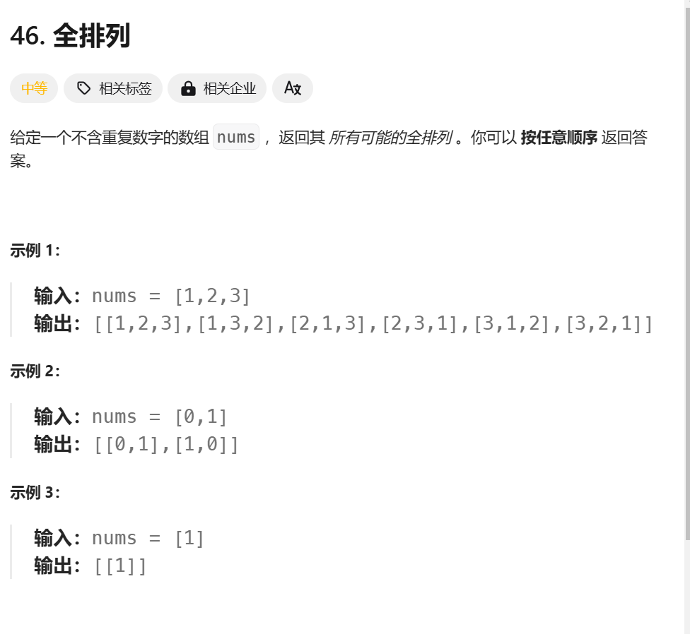
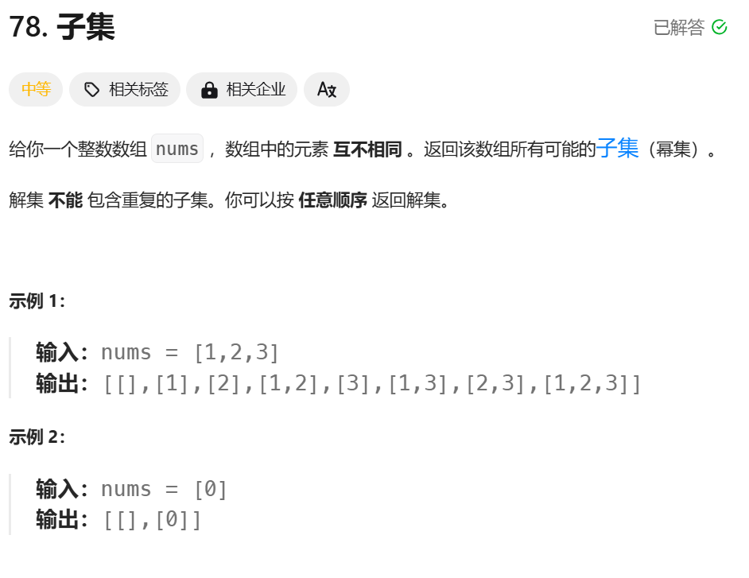

# Leetcode
??? note

    Lorem ipsum dolor sit amet, consectetur adipiscing elit. Nulla et
    euismod nulla. Curabitur feugiat, tortor non consequat finibus, justo
    purus auctor massa, nec semper lorem quam in massa.


```cpp title="example.cpp" linenums="1" hl_lines="2-4"
#include <iostream>
using namespace std;
//others 
int main() {
    return 0;
}
```


### Code Blocks in Content Tabs

=== "Python"

    ```py
    def main():
        print("Hello world!")
    
    if __name__ == "__main__":
        main()
    ```

=== "JavaScript"

    ```js
    function main() {
        console.log("Hello world!");
    }
    
    main();
    ```


## 2.18 leetcode100-回溯-全排列


以下是答案的解法，已经将时间复杂度优化到最佳

```cpp title="答案的解法" linenums="1"
class Solution {
    public:
    void backtrack(int first,int len,vector<int>& output,vector<vector<int>> &res){
        //表示我将数组坐标为first-1及其之前的元素全部排好固定了，接下来要排好index为first及其之后的所有数后将所有的结果放入res容器,并且全部操作完之后要求output容器中的元素次序与调用该次backtrack前的次序严格不变
        if(first == len){
            res.emplace_back(output);
            return;
        }
        for(int i = first;i <= len-1;i++){
            swap(output[i],output[first]);
            backtrack(first+1,len,output,res);
            swap(output[i],output[first]);
        }
    }
    vector<vector<int>> permute(vector<int>& nums) {
        vector <vector<int>> res;
        backtrack(0,(int)nums.size(),nums,res);
        return res;
    }
};
```

以下展示我的解法：比较原始，就是新建一个v数组来记录使用了哪一些数，

!!! note
    函数形参中vector要的带&


```cpp
class Solution {
    public:
	void backtrack(vector<int> &v,vector<vector<int>> &res,vector<int> &output,vector<int> &nums,int first){//即将塞进索引为first的位置
        if(first == nums.size()){
            res.push_back(output);
            return;
        }
        for(int i = 0;i < nums.size();i++){
            if(v[i] == 0){
                output.push_back(nums[i]);
                v[i] = 1;
                backtrack(v,res,output,nums,first + 1);
                output.pop_back();
                v[i] = 0;
            }

        }
    }
    vector<vector<int>> permute(vector<int>& nums) {
        vector<vector<int>> res;
        vector<int> v(nums.size(),0);
        vector<int> output;
        backtrack(v,res,output,nums,0);
        retur
        
    }
};
```

## 2.18 leetcode100-回溯-子集



我写的解法：

```cpp
class Solution {
public:
    vector<vector<int>> subsets(vector<int>& nums) {
        vector<vector<int>> res;
        vector<int> output;
        backtrack(res,output,nums,0);
        return res;

    }
    void backtrack(vector<vector<int>> &res,vector<int> &output,vector<int> &nums,int first){
        //index first is to be done 会在output的基础上，将first及其之后的所有子集可能放到res里面,,output讨论了索引为first-1及其之前的所有数,并且output调用前后保持不变
        if(first == nums.size()){
            res.emplace_back(output);
            return;
        }
        output.emplace_back(nums[first]);
        backtrack(res,output,nums,first + 1);
        output.pop_back();
        backtrack(res,output,nums,first + 1);
    }

};
```

??? tip "优化"
    由于res数组和output都是两个函数都在使用的，所以直接定义到public内的变量，不需要在递归函数中反复传递（因为你已经确保output容器在backtrack调用前后保持不变）类似“全局”的变量？


## 2.18

