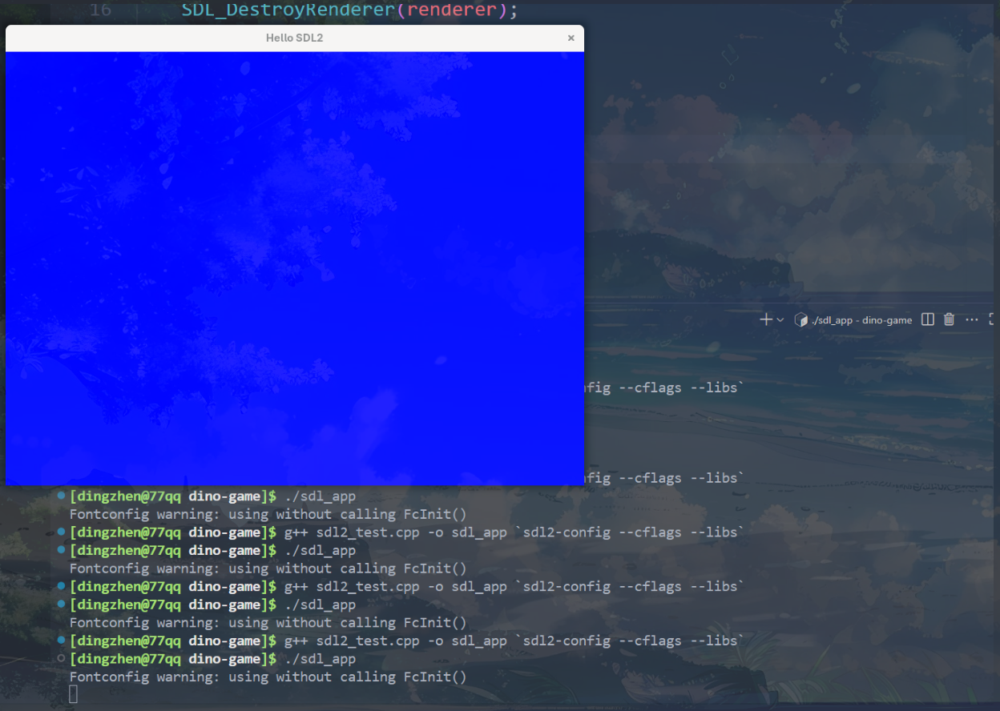
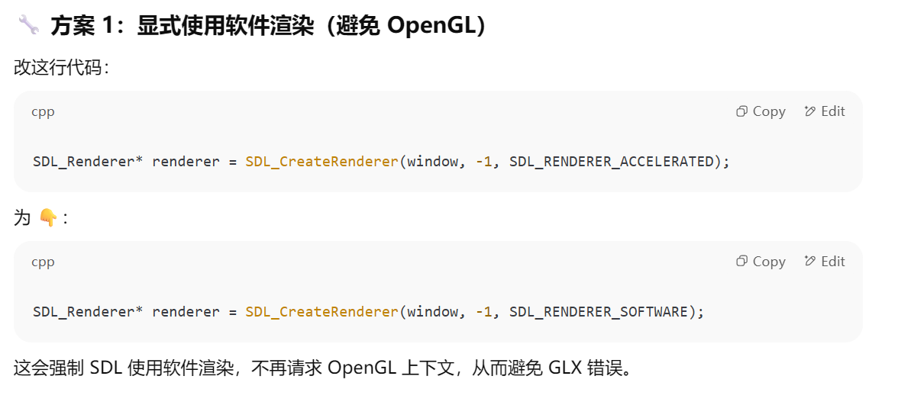
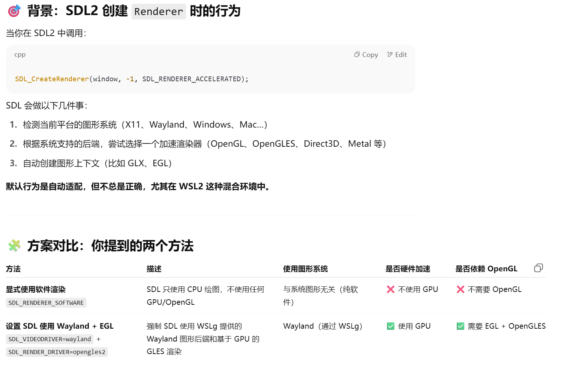
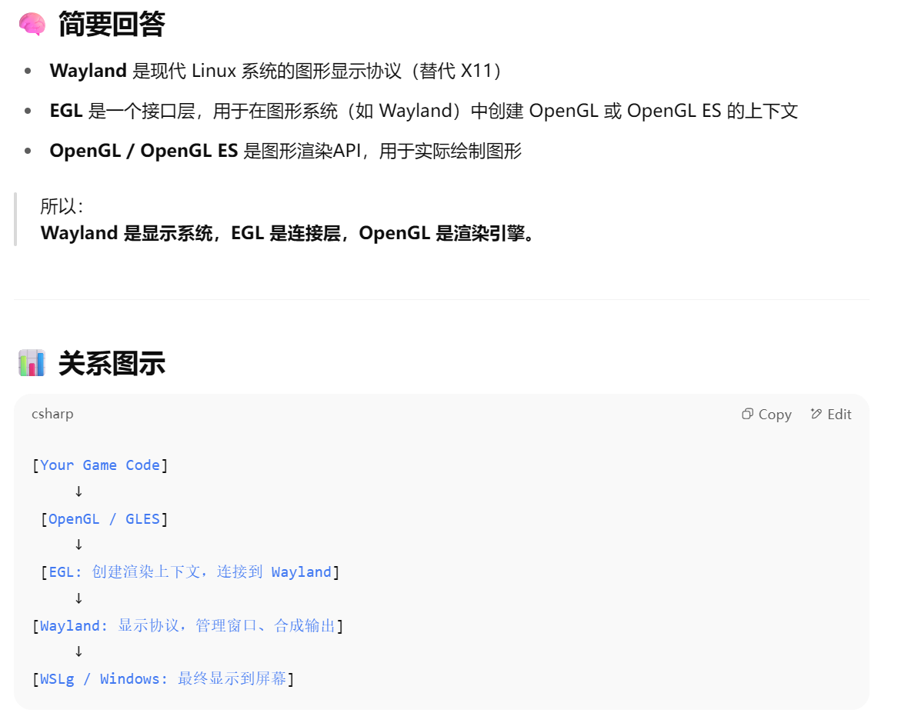
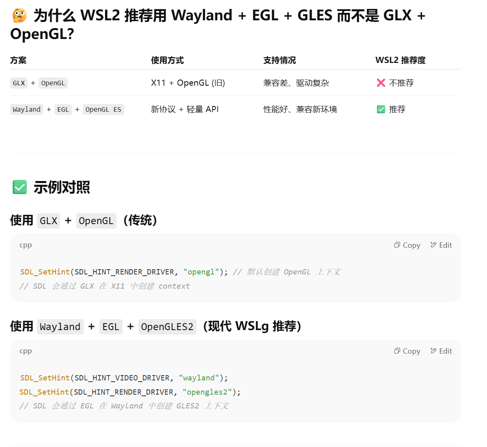
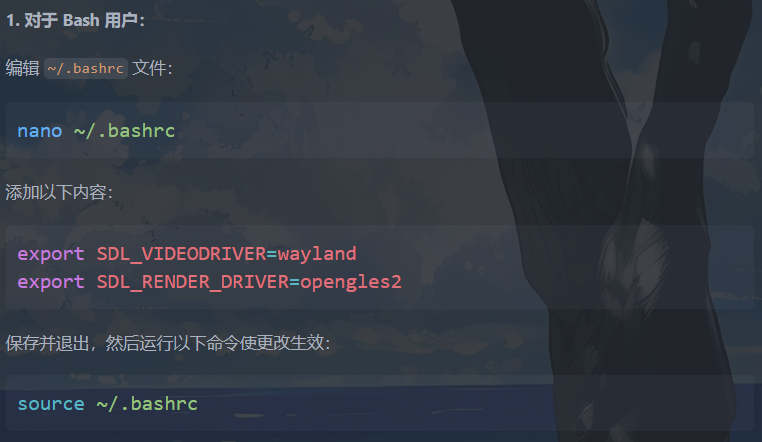

# cpp game
用arch linux in wsl2开发一个cpp的游戏项目
## get started

??? tip "available options"
    在 Windows 上使用 WSL2 + Arch Linux 来开发一个 C++ 游戏项目时，要实现图形化界面支持，你可以结合以下技术来实现开发环境、图形显示和调试体验：

    ---

    ### 🎮 1. 图形界面支持方式

    #### ✅ 方案一：使用 Windows 上的图形服务（推荐）

    **使用 Windows 的 X Server + WSLg**
    WSL2 从 Windows 11 开始自带 **WSLg（Windows Subsystem for Linux GUI）**，它支持在 Linux 子系统中直接运行 GUI 程序（包括基于 X11 和 Wayland 的程序）。

    * **适合人群**：使用 Windows 11 的开发者（最推荐）
    * **优点**：

    * 零配置 GUI 支持
    * 可以运行 Linux 下的 GUI 工具（如 VS Code、SDL/OpenGL 窗口）
    * **兼容性**：WSLg 兼容 SDL2、OpenGL、Vulkan 等图形库

    🛠 **使用方法**：

    * 确保你的 WSL2 版本为 Windows 11 的 WSLg 支持版本
    * 在 Arch 中安装游戏相关库：

    ```bash
    sudo pacman -S sdl2 sdl2_image glew glfw mesa vulkan-icd-loader
    ```
    * 编译并运行 SDL/OpenGL 程序，窗口会自动弹出（由 Windows 的 WSLg 显示）

    ---

    #### ✅ 方案二：使用 Windows 的 X Server（例如 VcXsrv、X410）

    如果你使用 Windows 10 或禁用了 WSLg，可以使用 X Server：

    * **安装 X Server（Windows）**：

    * [VcXsrv](https://sourceforge.net/projects/vcxsrv/)
    * [X410](https://x410.dev/)
    * 启动 X Server 后，在 Arch 中设置环境变量：

    ```bash
    export DISPLAY=$(cat /etc/resolv.conf | grep nameserver | awk '{print $2}'):0
    export LIBGL_ALWAYS_INDIRECT=1
    ```
    * 之后运行图形程序（如 SDL/OpenGL），会通过 X Server 在 Windows 上显示

    ---

    ### 🔧 2. 游戏开发相关工具链建议

    | 类型   | 工具/库                          | 安装命令                                                |
    | ---- | ----------------------------- | --------------------------------------------------- |
    | 编译器  | `gcc` / `clang`               | `sudo pacman -S gcc clang`                          |
    | 构建系统 | `cmake` / `meson`             | `sudo pacman -S cmake meson ninja`                  |
    | 图形库  | `SDL2`, `OpenGL`, `Vulkan`    | `sudo pacman -S sdl2 glew glfw mesa vulkan-headers` |
    | 编辑器  | `neovim` / `vscode` / `CLion` | VSCode可用Windows端，连接WSL调试                            |

    ---

    ### 🕹 示例：编译一个简单的 SDL2 程序

    1. 安装 SDL2：

    ```bash
    sudo pacman -S sdl2
    ```

    2. 编写 `main.cpp`：

    ```cpp
    #include <SDL2/SDL.h>
    int main() {
        SDL_Init(SDL_INIT_VIDEO);
        SDL_Window* window = SDL_CreateWindow("Hello SDL2", 100, 100, 800, 600, SDL_WINDOW_SHOWN);
        SDL_Delay(3000);
        SDL_DestroyWindow(window);
        SDL_Quit();
        return 0;
    }
    ```

    3. 编译并运行：

    ```bash
    g++ main.cpp -o sdl_app `sdl2-config --cflags --libs`
    ./sdl_app
    ```

    如果你用的是 WSLg 或配置好了 X Server，窗口就能正常显示。

    ---

    ### 💡 如果你用 Vulkan 或 OpenGL：

    * WSLg 支持 **OpenGL + Vulkan 显示加速**
    * 可结合 `vulkan-tools` 测试：

    ```bash
    sudo pacman -S vulkan-tools
    vulkaninfo | less
    ```

    ---

    ### 🚀 推荐开发流程（Windows + WSL2）：

    1. 用 VS Code 的 **WSL Remote 插件** 开发代码
    2. 在 Arch 下使用 `cmake` 构建
    3. 用 SDL/OpenGL 编写游戏逻辑
    4. 用 WSLg 或 X Server 显示图形界面
    5. （可选）使用 git + GitHub/GitLab 做版本管理


- **my option:** 方案一：使用 Windows 上的图形服务

## 1. 在 Arch 中安装游戏相关库：
```bash
sudo pacman -S sdl2 sdl2_image glew glfw mesa vulkan-icd-loader
```

简单测试功能（after `sudo pacman -S sdl2`）：

编写：`sdl2_test.cpp`
```cpp
#include <SDL2/SDL.h>
int main() {
    SDL_Init(SDL_INIT_VIDEO);
    SDL_Window* window = SDL_CreateWindow("Hello SDL2", 100, 100, 800, 600, SDL_WINDOW_SHOWN);
    SDL_Delay(3000);
    SDL_DestroyWindow(window);
    SDL_Quit();
    return 0;
}
```

```
g++ sdl2_test.cpp -o sdl_app `sdl2-config --cflags --libs`
./sdl_app

```
🪟 显示效果（默认行为）
- 屏幕上会弹出一个尺寸为 800x600 像素的空窗口

- 标题栏显示为 "Hello SDL2"

- 窗口背景是默认的 黑色 或 白色（取决于系统或 SDL 版本）

- 程序暂停 3 秒钟，然后窗口关闭退出

如果你想让窗口里看到一些图像内容（比如颜色或图形），需要使用 `SDL_Renderer` 来清屏和绘制。

例如用蓝色填充窗口：
```cpp
// 这段代码会显示一个纯蓝色窗口，持续 3 秒钟。
#include <SDL2/SDL.h>

int main() {
    SDL_Init(SDL_INIT_VIDEO);

    SDL_Window* window = SDL_CreateWindow("Hello SDL2", 100, 100, 800, 600, SDL_WINDOW_SHOWN);
    SDL_Renderer* renderer = SDL_CreateRenderer(window, -1, SDL_RENDERER_ACCELERATED);

    // 设置颜色为蓝色（R, G, B, A）
    SDL_SetRenderDrawColor(renderer, 0, 0, 255, 255);
    SDL_RenderClear(renderer);           // 用当前颜色清空窗口
    SDL_RenderPresent(renderer);         // 显示内容

    SDL_Delay(3000); // 显示 3 秒

    SDL_DestroyRenderer(renderer);
    SDL_DestroyWindow(window);
    SDL_Quit();
    return 0;
}

```
应该成功显示为


   
## 2. 设置 SDL 强制使用 Wayland + EGL 渲染

在初次运行以上绘制窗口（蓝色）的时候，尽管编译成功，但会在运行时候出现error：**SDL 在尝试使用 OpenGL 上下文时失败了**
```
X Error of failed request:  BadValue (integer parameter out of range for operation)
  Major opcode of failed request:  148 (GLX)
  Minor opcode of failed request:  3 (X_GLXCreateContext)
```
!!! failure 
    这个错误通常意味着 **SDL 在尝试使用 OpenGL 上下文时失败了**，而原因大多数和 图形环境配置不兼容 或 驱动/库缺失 有关。

    1. 你在 WSL2 中运行 SDL2/OpenGL 相关程序

    2. SDL 在创建 SDL_Renderer 时，内部会请求一个 OpenGL 上下文（可能是通过 GLX）

    3. WSL 的图形系统（尤其是非 WSLg，比如使用 VcXsrv 或 X410）不能正确处理这个 OpenGL 请求

解决方案：

!!! question "方案一(未采用):**显式使用软件渲染**"
    

    ✅ **最小可运行版本（使用软件渲染）**：如果你只是想确认 SDL 窗口能正常显示颜色，用这个代码即可：
    ``` cpp
    #include <SDL2/SDL.h>

    int main() {
        SDL_Init(SDL_INIT_VIDEO);
        SDL_Window* window = SDL_CreateWindow("Hello SDL2", 100, 100, 800, 600, SDL_WINDOW_SHOWN);
        SDL_Renderer* renderer = SDL_CreateRenderer(window, -1, SDL_RENDERER_SOFTWARE);

        SDL_SetRenderDrawColor(renderer, 0, 0, 255, 255); // 蓝色
        SDL_RenderClear(renderer);
        SDL_RenderPresent(renderer);

        SDL_Delay(3000);

        SDL_DestroyRenderer(renderer);
        SDL_DestroyWindow(window);
        SDL_Quit();
        return 0;
    }
    ```


!!! success "方案二（采用）:设置 SDL 强制使用 Wayland + EGL 渲染"

    如果你使用的是 Windows 11 + WSLg，建议你检查环境变量是否存在：
    ```shell
    echo $WAYLAND_DISPLAY
    ```

    **遇到的问题：**
    ```
    [dingzhen@man dino-game]$ echo $WAYLAND_DISPLAY
    wayland-0
    ```
    显示正常 但是SDL 在尝试使用 OpenGL 上下文时失败了

    `$WAYLAND_DISPLAY = wayland-0` 说明你使用的是 **WSLg**，也就是 **Windows 11 自带的图形支持环境**，它理论上支持 OpenGL 和 Vulkan。但是你仍然遇到 SDL + OpenGL 的 GLX 错误，这提示我们：

    > SDL 可能**误以为你在用 X11**，从而尝试用 **GLX**（OpenGL on X11）创建上下文，而不是用 Wayland 或 EGL。

    - ✅ 最关键的问题：**SDL 自动选择的图形后端有问题**

    即便你在 WSLg 下，SDL2 默认可能仍然走 X11 + GLX 路径，而不是 Wayland + EGL。


    **快速验证方案：检查 SDL 的 video driver**

    在终端运行：

    ```bash
    SDL_VIDEODRIVER=wayland ./sdl_app
    ```

    或者切换回 X11：

    ```bash
    SDL_VIDEODRIVER=x11 ./sdl_app
    ```

    ---

    **最直接的方法是：✔ 设置 SDL 强制使用 Wayland + EGL 渲染：**

    WSLg 支持 Wayland + EGL 更加稳定。你可以尝试运行前设置以下环境变量：

    ```bash
    export SDL_VIDEODRIVER=wayland
    export SDL_RENDER_DRIVER=opengles2
    ./sdl_app
    ```

    或者在程序中设置（必须在 `SDL_Init` 之前）：

    ```cpp
    SDL_SetHint(SDL_HINT_VIDEO_DRIVER, "wayland");
    SDL_SetHint(SDL_HINT_RENDER_DRIVER, "opengles2");
    ```

    这些设置会强制 SDL：

    * 使用 `Wayland` 而不是 `X11`
    * 使用 `EGL/OpenGL ES 2` 而不是 `GLX/OpenGL`

    ---

    - 📦 安装必要依赖库（Wayland & EGL 支持）

    确保你已经安装了支持 `EGL` 和 `Wayland` 的 Mesa 和 SDL 库：

    ```bash
    sudo pacman -S mesa libglvnd wayland libegl sdl2 sdl2_image
    ```

    ---

    ✅ 总结你的修复步骤建议：

    1. **确保 WSLg 在运行（你已经成功）**

    2. 设置 SDL 使用 Wayland + GLES：

    ```bash
    export SDL_VIDEODRIVER=wayland
    export SDL_RENDER_DRIVER=opengles2
    ```

    3. 确保安装了所有依赖库：

    ```bash
    sudo pacman -S mesa libegl libglvnd wayland
    ```

    4. 使用 `SDL_RENDERER_SOFTWARE` 是兜底方案


!!! question
    **以上你给出的措施中 ： 显式使用软件渲染（避免 OpenGL） 解决了问题，这个做法和后面你提出的设置 SDL 强制使用 Wayland + EGL 渲染有什么关联？**

    

!!! question "Wayland + EGL和OpenGL是什么关系?"
    
    

最终我们采用方案二：设置 SDL 强制使用 Wayland + EGL 渲染


## 走迷宫游戏（用于测试功能栈完整性）
以下是一个简单的实现，满足你的需求：一个 4x4 的方格游戏，玩家通过键盘上下左右键移动到随机生成的宝藏位置即可结束游戏。
```cpp
#include <SDL2/SDL.h>
#include <cstdlib>
#include <ctime>
#include <iostream>

const int GRID_SIZE = 4; // 4x4 方格
const int CELL_SIZE = 100; // 每个方格的大小
const int WINDOW_SIZE = GRID_SIZE * CELL_SIZE;

struct Position {
    int x, y;
};

void renderGrid(SDL_Renderer* renderer) {
    SDL_SetRenderDrawColor(renderer, 200, 200, 200, 255); // 灰色
    for (int i = 0; i <= GRID_SIZE; ++i) {
        SDL_RenderDrawLine(renderer, i * CELL_SIZE, 0, i * CELL_SIZE, WINDOW_SIZE); // 竖线
        SDL_RenderDrawLine(renderer, 0, i * CELL_SIZE, WINDOW_SIZE, i * CELL_SIZE); // 横线
    }
}

void renderPlayer(SDL_Renderer* renderer, Position player) {
    SDL_Rect rect = {player.x * CELL_SIZE, player.y * CELL_SIZE, CELL_SIZE, CELL_SIZE};
    SDL_SetRenderDrawColor(renderer, 0, 255, 0, 255); // 绿色
    SDL_RenderFillRect(renderer, &rect);
}

void renderTreasure(SDL_Renderer* renderer, Position treasure) {
    SDL_Rect rect = {treasure.x * CELL_SIZE, treasure.y * CELL_SIZE, CELL_SIZE, CELL_SIZE};
    SDL_SetRenderDrawColor(renderer, 255, 215, 0, 255); // 金色
    SDL_RenderFillRect(renderer, &rect);
}

int main() {
    SDL_Init(SDL_INIT_VIDEO);

    SDL_Window* window = SDL_CreateWindow("Treasure Hunt Game", SDL_WINDOWPOS_CENTERED, SDL_WINDOWPOS_CENTERED, WINDOW_SIZE, WINDOW_SIZE, SDL_WINDOW_SHOWN);
    SDL_Renderer* renderer = SDL_CreateRenderer(window, -1, SDL_RENDERER_ACCELERATED);

    std::srand(std::time(nullptr));

    Position player = {0, 0}; // 玩家初始位置
    Position treasure = {std::rand() % GRID_SIZE, std::rand() % GRID_SIZE}; // 随机生成宝藏位置

    bool running = true;
    SDL_Event event;

    while (running) {
        while (SDL_PollEvent(&event)) {
            if (event.type == SDL_QUIT) {
                running = false;
            } else if (event.type == SDL_KEYDOWN) {
                switch (event.key.keysym.sym) {
                    case SDLK_UP:
                        if (player.y > 0) player.y--;
                        break;
                    case SDLK_DOWN:
                        if (player.y < GRID_SIZE - 1) player.y++;
                        break;
                    case SDLK_LEFT:
                        if (player.x > 0) player.x--;
                        break;
                    case SDLK_RIGHT:
                        if (player.x < GRID_SIZE - 1) player.x++;
                        break;
                }
            }
        }

        // 检查是否找到宝藏
        if (player.x == treasure.x && player.y == treasure.y) {
            std::cout << "You found the treasure! Game over!" << std::endl;
            running = false;
        }

        // 渲染
        SDL_SetRenderDrawColor(renderer, 0, 0, 0, 255); // 黑色背景
        SDL_RenderClear(renderer);

        renderGrid(renderer);
        renderTreasure(renderer, treasure);
        renderPlayer(renderer, player);

        SDL_RenderPresent(renderer);
    }

    SDL_DestroyRenderer(renderer);
    SDL_DestroyWindow(window);
    SDL_Quit();
    return 0;
}
```

```
g++ -o treasure_game main.cpp -lSDL2
./treasure_game
```
应对之前提到的GLX上下文报错
```
[dingzhen@77qq dino-game]$ ./treasure_game
X Error of failed request: BadValue (integer parameter out of range for operation)
Major opcode of failed request: 148 (GLX)
Minor opcode of failed request: 3 (X_GLXCreateContext)
Value in failed request: 0x0
Serial number of failed request: 347
Current serial number in output stream: 348
```
采用措施：
要求使用Wayland + EGL + GLES 而不是 GLX + OpenGL

1. 运行程序前设置 SDL 使用 Wayland 和 EGL：
```shell
export SDL_VIDEODRIVER=wayland
export SDL_RENDER_DRIVER=opengles2
```

2. 修改代码以使用 GLES
SDL2 会自动选择 EGL 和 GLES2 渲染器，但你可以显式指定 GLES 渲染器。修改SDL_CreateRenderer 的标志：
```cpp
SDL_Renderer* renderer = SDL_CreateRenderer(window, -1, SDL_RENDERER_ACCELERATED | SDL_RENDERER_PRESENTVSYNC);
```
SDL 会自动选择 GLES 渲染器，无需额外配置。

3. 编译运行

**为了永久性配置，加到你的 shell 配置文件中**


