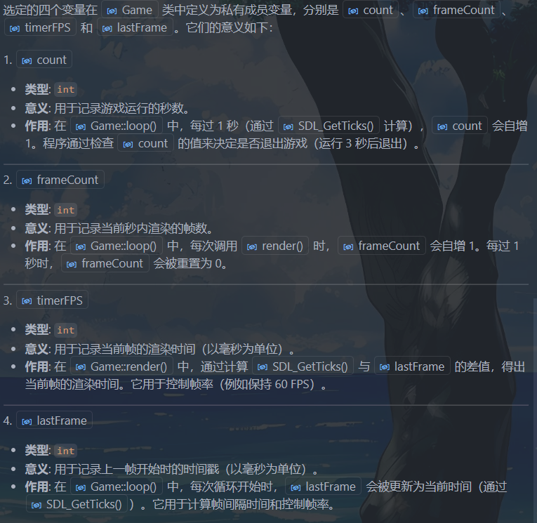
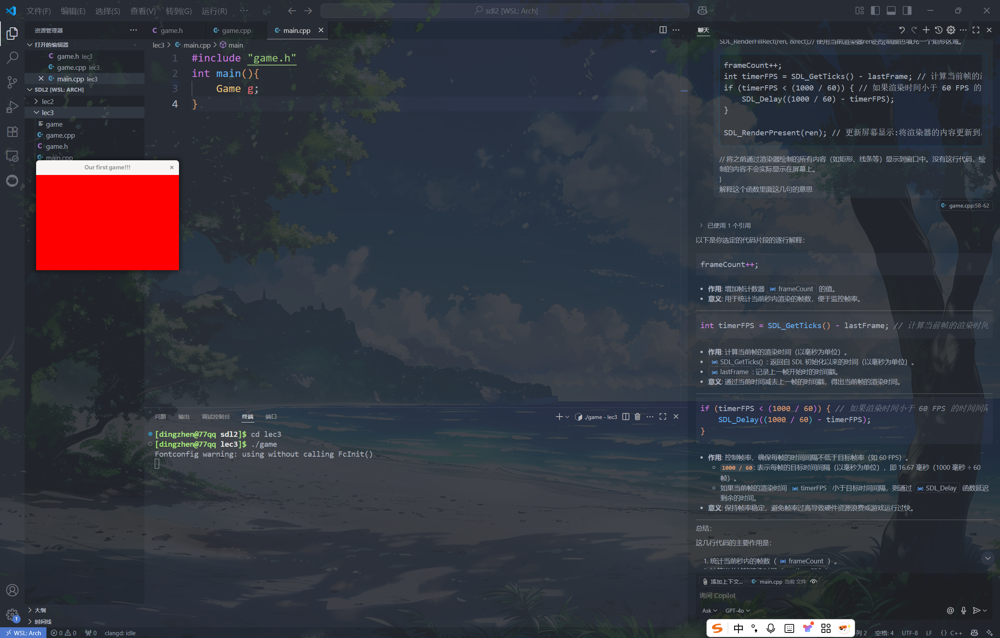

[C++ SDL2 Window Tutorial](https://www.youtube.com/watch?v=c5UEFzOJ9-U&list=PLVotA8ycjnCs3DNWIbEIpBrjYkhJq11q-&index=2)

## lec2: FPS, Keyboard, Fullscreen
```cpp
#include <SDL2/SDL.h>
#include <iostream>

#define WIDTH 1280
#define HEIGHT 720

bool running, fullscreen;
SDL_Renderer* renderer;
SDL_Window* window;
int frameCount, timerFPS, lastFrame, fps;


void update() {
    if (fullscreen) SDL_SetWindowFullscreen(window, SDL_WINDOW_FULLSCREEN);
    if (!fullscreen) SDL_SetWindowFullscreen(window, 0);
}

void input() {
    SDL_Event e;
    while (SDL_PollEvent(&e)) {
        if (e.type == SDL_QUIT) running = false;
    }
    const Uint8* keystates = SDL_GetKeyboardState(NULL);
    if (keystates[SDL_SCANCODE_ESCAPE]) running = false;
    if (keystates[SDL_SCANCODE_F11]) fullscreen =!fullscreen;
}

void draw() {
    SDL_SetRenderDrawColor(renderer, 40, 43, 200, 255);
/*
作用: 设置渲染器的绘制颜色。
参数 (40, 43, 200, 255) 分别表示 红色 (R)、绿色 (G)、蓝色 (B) 和 透明度 (A)。
这里设置的颜色是一个蓝色调（RGB 值为 40, 43, 200），完全不透明（A = 255）。
*/
    SDL_Rect rect;
    rect.x = rect.y = 0; // 矩形的左上角坐标为 (0, 0)，即窗口的左上角。
    rect.w = WIDTH;
    rect.h = HEIGHT;
    SDL_RenderFillRect(renderer, &rect);

    frameCount++;
    int timerFPS = SDL_GetTicks() - lastFrame;
    if (timerFPS < (1000 / 60)) {
        SDL_Delay((1000 / 60) - timerFPS);
    }

    SDL_RenderPresent(renderer);
}

int main() {
    running = 1;
    fullscreen = 0;
    static int lastTime = 0;
    if (SDL_Init(SDL_INIT_EVERYTHING) < 0) 
    //参数: SDL_INIT_EVERYTHING:这是一个宏，表示初始化 SDL 的所有子系统（如视频、音频、计时器等）。
        std::cout << "Failed at SDL_Init()" << std::endl;
    if (SDL_CreateWindowAndRenderer(WIDTH, HEIGHT, 0, &window, &renderer) < 0) //指向 SDL_Window* 的指针，用于存储创建的窗口。
        std::cout << "Failed at SDL_CreateWindowAndRenderer()" << std::endl; //指向 SDL_Renderer* 的指针，用于存储创建的渲染器。
    
    SDL_SetWindowTitle(window, "SDL2 Window");
    SDL_ShowCursor(1);
    SDL_SetHint(SDL_HINT_RENDER_SCALE_QUALITY, "2");//用于设置 SDL 渲染器的缩放质量提示。
/*
"0"：最近邻算法（Nearest Pixel Sampling），速度快，但质量低。
"1"：线性插值（Linear Filtering），质量较高。
"2"：各向异性过滤（Anisotropic Filtering），质量最高。
*/
    while (running) {
        lastFrame = SDL_GetTicks();
        if (lastFrame >= (lastFrame + 1000)) { 
            lastTime = lastFrame;
            fps = frameCount;
            frameCount = 0;
        }
        std::cout << fps << std::endl;

        update();
        input();
        draw();
    }

    SDL_DestroyRenderer(renderer);
    SDL_DestroyWindow(window);
    SDL_Quit();

    return 0; 
}
```

## lec3: Window & Gameloop
**关于FPS：** Frames Per Second，表示每秒钟渲染或显示的画面帧数，反映了游戏或图形程序运行的流畅程度。

常见的 FPS 范围：
30 FPS: 基本流畅，适合一些低要求的游戏或动画。
60 FPS: 流畅的体验，常见于大多数现代游戏。
120 FPS 或更高: 超高流畅度，适合高端显示器和硬件。


??? note "game.cpp"
    ```cpp
    // game.cpp
    # include "game.h"
    #include <SDL2/SDL.h>
    #include <SDL2/SDL_render.h>
    Game::Game() {
        SDL_Init(0);
        SDL_CreateWindowAndRenderer(360, 240, 0, &win, &ren);
        SDL_SetWindowTitle(win, "Our first game!!!");
        running = true;
        count = 0;
        loop(); 
    }

    Game::~Game() {
        SDL_DestroyRenderer(ren);
        SDL_DestroyWindow(win);
        SDL_Quit();
    }

    void Game::loop() {
        while (running) {

    /*
    frameCount: 用于记录当前秒内渲染的帧数。
    timerFPS: 用于计算当前帧的渲染时间。ms
    lastFrame: 用于记录上一次渲染的时间戳，ms

    */
            lastFrame = SDL_GetTicks();// ms
            static int lastTime;
            if(lastFrame >= (lastTime + 1000)) {
                lastTime = lastFrame;
                frameCount = 0;
                count++;
            }
            render();
            input();
            update();

            if(count > 3) running = false; // 运行3秒后退出
            
        }
    }


    void Game::render(){
        SDL_SetRenderDrawColor(ren,255,0,0,255);
        /*
    255, 0, 0: 表示颜色的 RGB 值，这里是红色（R=255，G=0，B=0）。
    255: 表示颜色的 alpha 值（透明度），255 表示完全不透明。
        */
        SDL_Rect rect;
        rect.x = 0; // 矩形的左上角 x 坐标
        rect.y = 0; // 矩形的左上角 y 坐标
        rect.w = 360; // 矩形的宽度
        rect.h = 240; // 矩形的高度
        SDL_RenderFillRect(ren, &rect);//  使用当前渲染器ren的绘制颜色填充一个矩形区域。

        frameCount++;
        int timerFPS = SDL_GetTicks() - lastFrame; // 计算当前帧的渲染时间。ms
        if (timerFPS < (1000 / 60)) { // 如果渲染时间小于 60 FPS 的时间间隔，则延迟以保持帧率。
            SDL_Delay((1000 / 60) - timerFPS);
        }

        SDL_RenderPresent(ren); // 更新屏幕显示:将渲染器的内容更新到屏幕上。
    // 将之前通过渲染器绘制的所有内容（如矩形、线条等）显示到窗口中。没有这行代码，绘制的内容不会实际显示在屏幕上。
    }

    ```

??? note "game.h"
    ```cpp
    // game.h
    #ifndef GAME_H
    #define GAME_H

    #include <SDL2/SDL.h>

    #include <iostream>
    using namespace std;

    class Game{
    public:
        Game();
        ~Game();
        void loop();
        void update(){}
        void input(){}
        void render();
    private:
        SDL_Renderer* ren;
        SDL_Window* win;
        bool running;
        int count;// 记录游戏运行的秒数
        int frameCount , timerFPS , lastFrame;
    /*
    frameCount: 用于记录当前秒内渲染的帧数。
    timerFPS: 用于计算当前帧的渲染时间。ms
    lastFrame: 用于记录上一次渲染的时间戳，ms

    */
    };


    #endif // GAME_H
    ```

??? note "main.cpp"
    ```cpp

    // main.cpp
    #include "game.h"
    int main(){
        Game g;
    }
    ```

运行效果：



## lec4: Objects and Drawing

### 像素（pixels）
这里所有坐标的单位都是**像素（pixels）**

=== "像素"

    像素（**Pixel**，来自“Picture Element”）是**数字图像的最小单位**。


    一个像素 = 图像中一个点

    它表示一张图片上最小的**颜色单位**，就像马赛克的一个格子。

    举个例子：

    * 一张 **1920 × 1080** 的图片有 1920 个横向像素、1080 个纵向像素；
    * 总共像素数 = 1920 × 1080 = 2,073,600 像素（即“200万像素”）。

    ---

    **🔍 像素包含什么内容？**

    每个像素记录一个颜色，通常包括：

    * **RGB 值**：红（Red）、绿（Green）、蓝（Blue）的组合；

    * 比如 (255, 0, 0) 表示纯红色；
    * 有时还包含 **透明度（Alpha 值）**，比如在 PNG 格式中。

    ---

    🖼 举例说明：

    一张小图（3×2）：

    |    |    |    |
    | -- | -- | -- |
    | 🔴 | 🔵 | ⚪  |
    | ⚫  | 🟢 | 🔴 |

    这是一个 **3像素宽 × 2像素高** 的图像，共 6 个像素，每个小图标相当于一个像素。

    ---

    **🧠 像素 ≠ 实际尺寸（比如厘米）**

    图像实际显示的大小还取决于：

    * **分辨率（如 72 DPI, 300 DPI）**
    * **显示设备的密度（像素/英寸）**

    比如：

    * 同样是 500 像素宽的图片，在手机屏幕上看起来比在大显示器上小。


=== "分辨率"

    **分辨率**指的是图像或屏幕上**水平方向和垂直方向的像素数量**，表示图像的“清晰度”或“细节程度”。

    ---

    🧩 分辨率的定义：

    分辨率 = **宽 × 高**

    举例：

    | 分辨率         | 说明               | 总像素数量               |
    | ----------- | ---------------- | ------------------- |
    | 800 × 600   | 老式显示器的常见分辨率      | 480,000 像素          |
    | 1920 × 1080 | 全高清（Full HD）     | 2,073,600 像素（约200万） |
    | 3840 × 2160 | 4K 超高清（Ultra HD） | 8,294,400 像素（约800万） |

    ---

    #### 📺 两种常见场景下的分辨率解释：

    1. **屏幕分辨率**（显示设备）

        指的是屏幕上能显示多少像素，比如你的电脑或手机屏幕。

        * 一台 **1920×1080** 的显示器，屏幕可以横向显示 1920 个像素，纵向显示 1080 个像素。
        * 分辨率越高，图像越细腻，但如果屏幕不够大，字体可能会显得很小。

        👉 所以分辨率和\*\*屏幕尺寸（英寸）\*\*配合使用，才决定你看到的大小。


    2. **图像分辨率**（图片文件）

        指的是图片本身包含多少像素，常见于照片、截图。

        * 一张 **3000×2000** 的照片，共有 600 万个像素（6MP）；
        * 如果打印，通常还会配合 **DPI（每英寸像素点数）** 使用来控制打印大小。

    🧠 拓展：分辨率 ≠ 清晰度？

    不完全等价：

    * **分辨率高** → 细节多，理论上更清晰；
    * 但若屏幕太小、压缩严重、对比度差，依然可能看不清。


    > **分辨率是衡量图像或屏幕能显示多少像素的指标，格式为“宽 × 高”。它影响图像的细节程度。**


定义`object`类

```cpp 
class Object {
private:
    SDL_Rect dest;// 定义裁剪后的纹理在屏幕上的显示位置和大小。位置和缩放
    SDL_Rect src;// 从纹理（图像）中裁剪的区域
    SDL_Texture* tex;
public:
    Object(){}
    SDL_Rect getDest() const { return dest; }
    SDL_Rect getSource() const { return src; }
    void setDest(int x, int y, int w, int h) ;
    void setSource(int x, int y, int w, int h) ;
    void setImage(string filename , SDL_Renderer* ren);
    SDL_Texture* getTex() const { return tex; }
};

```


