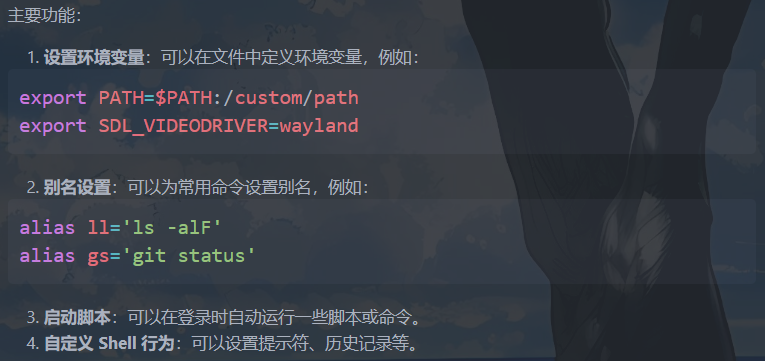
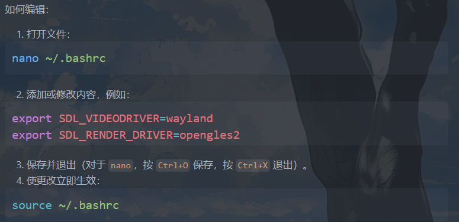

# linux
## wsl打不开解决方法
```
C:\Users\78100>wsl
灾难性故障
错误代码: Wsl/Service/E_UNEXPECTED
```

按 Win + R，输入 services.msc 打开服务管理器。

找到 “LxssManager” 服务，右键选择 “重新启动”。
```
wsl --shutdown
wsl
```

## 基操
[菜鸟教程 Linux 命令手册](https://www.runoob.com/linux/linux-command-manual.html){:target="_blank"}

```shell
# 强制+递归 的删除  -f强制  r递归
rm -rf /path/to/folder
```

## 常识
- `~/.bashrc` 是一个配置文件，用于为 Bash Shell 设置用户级别的环境变量和启动配置。它是每个用户的专属文件，位于用户的主目录下（~ 表示主目录）。
    
    
    
    source命令重新加载当前用户的 bash 配置文件（~/.bashrc），使文件中的更改立即生效，而无需关闭并重新打开终端。

## pacman
pacman -S 用法

```shell
# -S 表示 "Sync" - 同步/安装软件包
sudo pacman -S package_name

# 常用组合：
sudo pacman -S sfml          # 安装 sfml
sudo pacman -Sy             # 同步软件包数据库
sudo pacman -Su             # 升级所有已安装的软件包
sudo pacman -Syu            # 同步数据库并升级系统（完整系统更新）
sudo pacman -Ss search_term # 搜索软件包
sudo pacman -Si package     # 显示软件包详细信息
```

主要 pacman 操作：
- -S (Sync) - 安装/同步软件包
-  -R (Remove) - 删除软件包
- -Q (Query) - 查询已安装的软件包
- -U (Upgrade) - 从本地文件安装/升级

