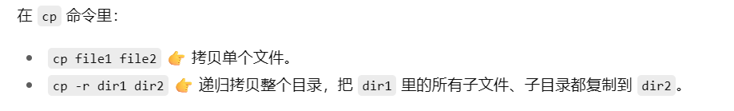

# linux
```shell
sudo apt update && sudo apt upgrade -y
```
-y自动确认升级，不用手动输入y

更彻底
```shell
sudo apt update && sudo apt full-upgrade -y && sudo apt autoremove -y && sudo apt clean
```
## WSL操作
或者直接cmd中输入wsl启动默认发行版

打开windows资源管理器，地址栏输入转到 Arch 系统的根目录（/）
```shell
\\wsl$\Arch
```
同理
```shell
\\wsl$\Ubuntu
```
```shell
C:\Windows\System32>wsl -l -v
  NAME      STATE           VERSION
* Arch      Stopped         2
  Ubuntu    Stopped         2
```
```shell
C:\Windows\System32>wsl --set-default Ubuntu
操作成功完成。
```

## linux基操
[菜鸟教程 Linux 命令手册](https://www.runoob.com/linux/linux-command-manual.html){:target="_blank"}

### rm
```shell
# 强制+递归 的删除  -f强制  r递归
rm -rf /path/to/folder
```

### cp
`cp`复制文件指令



### tar打包

只打包可运行版本:
```shell
mkdir -p release
cp build/bin/mygame release/
cp -r assets release/
cp README.md release/
```
`-r`参数是递归，


```shell
tar -czvf mygame-v1.0.0-linux.tar.gz release/
```
- c = create 创建

- z = gzip 压缩

- v = verbose 显示过程（可省略）

- f mygame-v1.0.0-linux.tar.gz = 输出文件名
- release 要打包的目录

`mygame-v1.0.0-linux.tar.gz` 就是一个干净的发行版压缩包。


解压：
```shell
tar -xzvf minisql-master.tar.gz
```
- x：解压
- z：解压 gzip 格式
- v：显示过程（可选）
- f：指定文件名

如需指定解压到某个目录，例如 ~/code/minisql，可以这样
```shell
tar -xzvf minisql-master.tar.gz -C ~/code/minisql
```

## 常识
### `~`目录下隐藏文件
```shell
ls -a
```
“隐藏文件”（以 `.` 开头的）在 Ubuntu（包括 WSL2 环境）中的常见作用。

🗂️ 常见的隐藏文件/文件夹作用说明：

1. `.cache/`

* **作用**：用于存放应用程序生成的缓存文件。
* **举例**：

  * 浏览器缓存
  * `pip` 下载的 wheel 文件缓存
  * GNOME 或其他桌面组件的缓存（在完整桌面 Linux 中）
* **可以删除吗？**：通常可以安全删除，不影响功能，但可能导致软件重新生成缓存（稍慢）。

---

2. `.bashrc`

* **作用**：是 bash shell 启动时读取的配置文件之一，定义环境变量、别名、启动命令等。
* **常见用途**：

  * 添加别名：`alias ll='ls -la'`
  * 设置路径：`export PATH=$PATH:/my/custom/path`
* **修改它可以定制终端体验**。

---

3. `.profile` / `.bash_profile`

* **作用**：定义登录 shell（如登录终端）加载的环境变量或启动脚本。一般配合 `.bashrc` 使用。
* 在 WSL 中也常见 `.profile`，用于设置 PATH 或启动服务。

---

4. `.config/`

* **作用**：存储桌面应用或 CLI 应用的配置信息（配置文件）。
* **内容示例**：

  * `.config/git/config`：Git 的配置
  * `.config/code/`：VS Code 的配置（如果你在 WSL 中使用 VS Code）

---

5. `.local/`

* **作用**：用户级别的本地应用和数据目录。
* **重要子目录**：

  * `.local/bin/`：用户安装的可执行程序（如 `pip install --user` 安装的命令）
  * `.local/share/`：应用程序存储的数据，比如字体、桌面快捷方式

---

6. `.bash_history`

* **作用**：记录你在 bash 中输入过的命令。
* 退出终端后，它会将历史命令保存下来，方便下次使用上下箭头查找。

---

7. `.gitconfig`

* **作用**：你的 Git 全局配置文件，例如设置用户名、邮箱、默认编辑器等。

```ini
[user]
  name = yourname
  email = your@email.com
```

---

8. `.ssh/`

* **作用**：SSH 相关配置和密钥存储目录。
* 常见文件：

  * `id_rsa`：私钥
  * `id_rsa.pub`：公钥
  * `known_hosts`：记录你连接过的主机公钥信息

---

**✅ 总结**

| 文件/目录           | 作用简述        | 是否可修改/删除  |
| --------------- | ----------- | --------- |
| `.cache/`       | 应用缓存        | ✅ 通常可删    |
| `.bashrc`       | Shell 配置    | ✅ 可修改     |
| `.config/`      | 应用配置文件      | ⚠️ 小心删    |
| `.local/`       | 用户级程序/数据    | ✅ 可用作安装路径 |
| `.bash_history` | 命令历史记录      | ✅ 可清除     |
| `.ssh/`         | SSH 密钥和配置   | ❌ 不建议删除   |
| `.gitconfig`    | Git 的全局配置文件 | ✅ 可修改     |


## 被遗弃的arch
- wsl打不开解决方法
```
C:\Users\78100>wsl
灾难性故障
错误代码: Wsl/Service/E_UNEXPECTED
```

按 Win + R，输入 services.msc 打开服务管理器。

找到 “LxssManager” 服务，右键选择 “重新启动”。
```
wsl --shutdown
wsl
```


- `~/.bashrc` 是一个配置文件，用于为 Bash Shell 设置用户级别的环境变量和启动配置。它是每个用户的专属文件，位于用户的主目录下（~ 表示主目录）。
    
    
    
    source命令重新加载当前用户的 bash 配置文件（~/.bashrc），使文件中的更改立即生效，而无需关闭并重新打开终端。

**pacman**

pacman -S 用法

```shell
# -S 表示 "Sync" - 同步/安装软件包
sudo pacman -S package_name

# 常用组合：
sudo pacman -S sfml          # 安装 sfml
sudo pacman -Sy             # 同步软件包数据库
sudo pacman -Su             # 升级所有已安装的软件包
sudo pacman -Syu            # 同步数据库并升级系统（完整系统更新）
sudo pacman -Ss search_term # 搜索软件包
sudo pacman -Si package     # 显示软件包详细信息
```

主要 pacman 操作：
```shell
-S (Sync) # 安装/同步软件包
-R (Remove) # 删除软件包
-Q (Query) # 查询已安装的软件包
-U (Upgrade) # 从本地文件安装/升级
```

