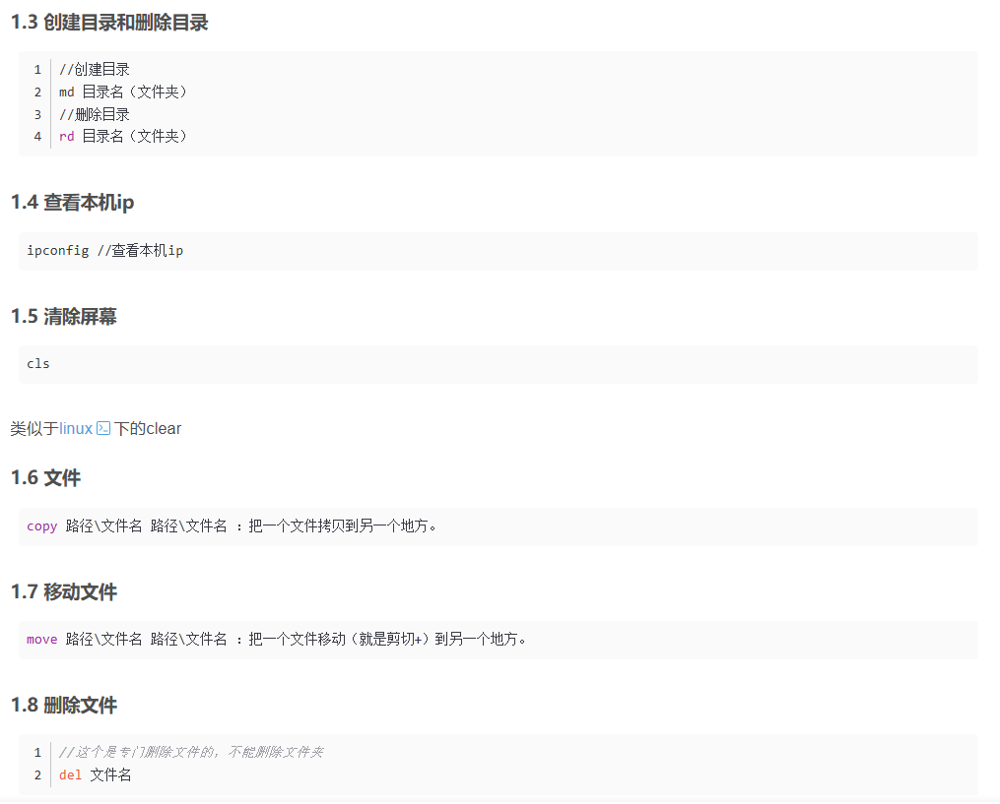

# linux
## Windows **cmd** operation
- 新建文件：`echo. > "C:\Windows\System32\cmd.exe"` 最后的一个”可有可无，聪明的windows cmd知道你的意思
- cd命令：
```  
//进入d盘
D:
//进入F盘
F:
cd /?     //获取使用帮助

cd \       //跳转到硬盘的根目录

cd C:\WINDOWS  //跳转到当前硬盘的其他文件

d:        //跳转到其他硬盘

cd /d e:\software    //跳转到其他硬盘的其他文件夹，注意此处必须加/d参数。否则无法跳转。

cd..      //跳转到上一层目录
```
- dir ： 查看当前目录下的文件
- 

