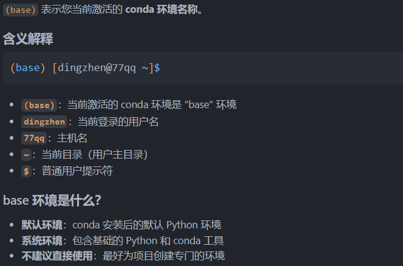

# data-marketplace

## 配置环境：在arch linux中
### 1. 安装基础 Python 环境
```bash
# 更新系统
sudo pacman -Syu

# 安装 Python（通常已预装）
sudo pacman -S python python-pip

# 验证安装
python --version
pip --version
```
### 2. 安装 Miniconda（推荐）


!!! info 什么是conda？
    Conda 是一个开源的包管理器和环境管理系统，专为数据科学和机器学习项目设计。

    - 包管理器：安装、更新、删除软件包
        ```bash
        # 安装包（比如您代码中用的 numpy）
        conda install numpy

        # 安装特定版本
        conda install numpy=1.21.0

        # 搜索包
        conda search numpy

        # 更新包
        conda update numpy
        ```
    - 环境管理器：创建隔离的 Python 环境
        ```bash
        # 创建环境（您刚才用的）
        conda create -n data-marketplace python=3.13

        # 激活环境
        conda activate data-marketplace

        # 查看所有环境
        conda env list

        # 删除环境
        conda env remove -n old-env
        ```


```bash
# 下载 Miniconda
wget https://repo.anaconda.com/miniconda/Miniconda3-latest-Linux-x86_64.sh

# 安装
bash Miniconda3-latest-Linux-x86_64.sh

# 重新加载 shell 配置 -》 转到(base)模式：(base) [dingzhen@77qq ~]$
source ~/.bashrc

# 验证安装
conda --version
```

(base) 表示您当前激活的 conda 环境名称。



环境切换实例：
```bash
# 当前在 base 环境
(base) [dingzhen@77qq ~]$ 

# 创建项目专用环境
(base) [dingzhen@77qq ~]$ conda create -n data-marketplace python=3.9

# 激活项目环境
(base) [dingzhen@77qq ~]$ conda activate data-marketplace

# 提示符会变成：
(data-marketplace) [dingzhen@77qq ~]$ 

# 退出环境回到 base
(data-marketplace) [dingzhen@77qq ~]$ conda deactivate
(base) [dingzhen@77qq ~]$ 
```
### 3. 为您的项目创建专用环境
```bash
# 使用您现有的 Python 3.13.5 创建 conda 环境
(base) [dingzhen@77qq ~]$ conda create -n data-marketplace python=3.13

# 激活环境
(base) [dingzhen@77qq ~]$ conda activate data-marketplace

# 验证环境中的 Python 版本
(data-marketplace) [dingzhen@77qq ~]$ python --version


# 测试 numpy 是否正常工作
python -c "import numpy as np; print(np.__version__)"

# 测试您的 metrics.py 文件
python -c "from utils.metrics import rmse; print('Environment ready!')"

```

!!! tip

    替代方案：使用系统包管理器(如果您不想使用 conda，可以直接用系统的 Python)
    ```bash
    # 使用 pip 安装项目所需包
    [dingzhen@77qq ~]$ pip install numpy pandas scikit-learn matplotlib

    # 或使用 Arch 包管理器
    [dingzhen@77qq ~]$ sudo pacman -S python-numpy python-pandas python-scikit-learn python-matplotlib
    ```
    


**推荐的工作流程:**
```bash
# 每次开始工作
conda activate data-marketplace
cd /home/dingzhen/Projects/data-marketplace

# 运行您的代码
python -c "from utils.metrics import gain_function; print('Environment ready!')"
```
