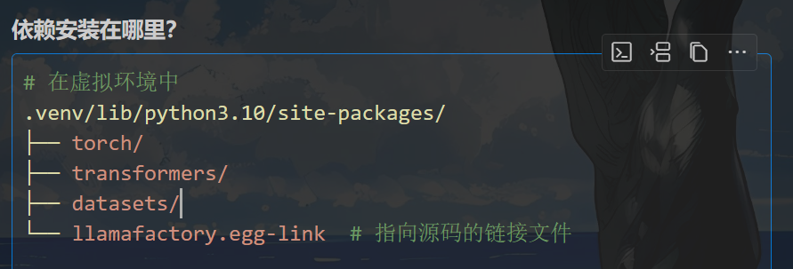
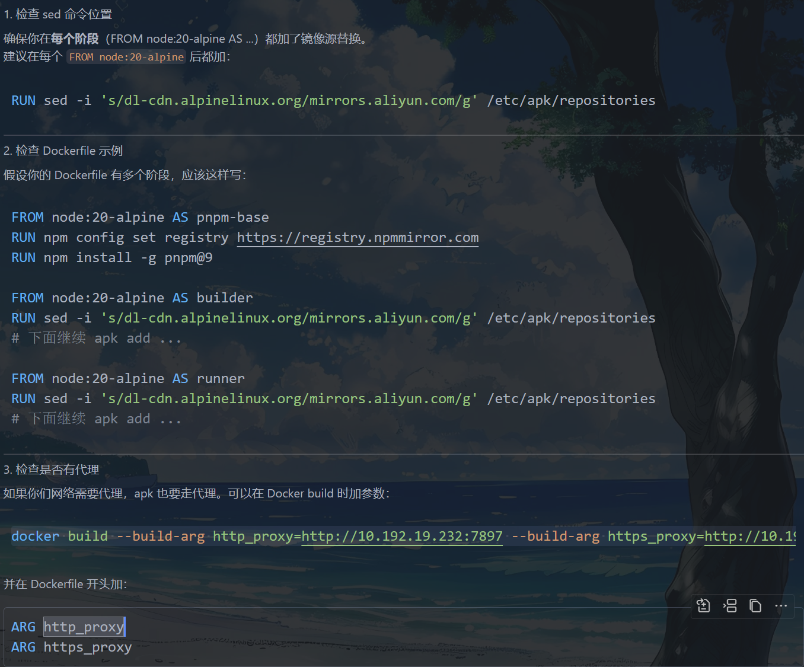
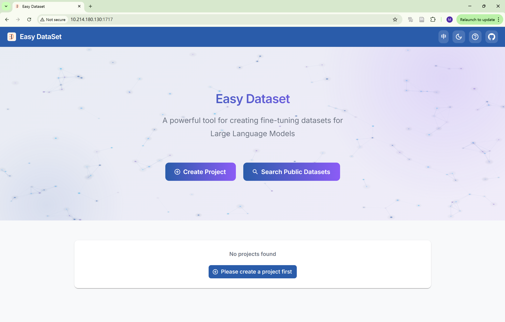
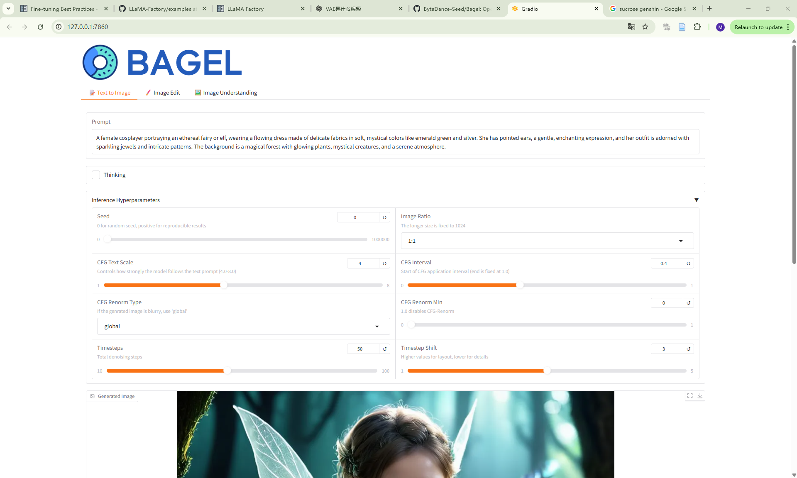
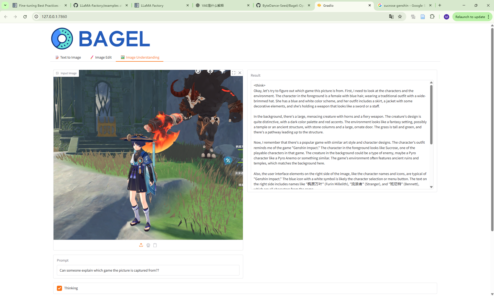
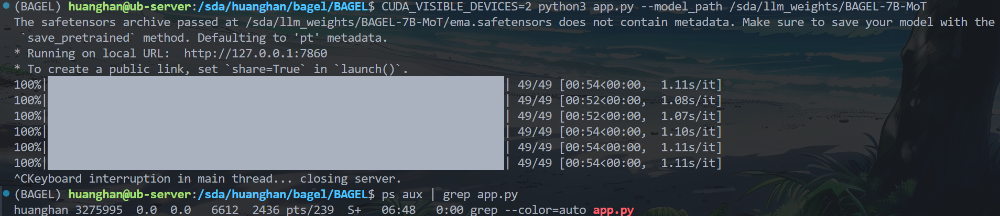

## llama-factory
使用uv去管理python项目的依赖
```bash
# 克隆 LLaMA-Factory
git clone https://github.com/hiyouga/LLaMA-Factory.git
cd LLaMA-Factory
# 使用 uv 创建虚拟环境
uv venv
# 激活虚拟环境
source .venv/bin/activate

# 确认环境已激活（命令行前面应该显示 (.venv)）
which python

(LLaMA-Factory) huanghan@ub-server:/sda/huanghan/llama-factory/LLaMA-Factory$ which python
/sda/huanghan/llama-factory/LLaMA-Factory/.venv/bin/python
```
```bash
# 安装 LLaMA-Factory 依赖
uv pip install -e .

# 等待安装完成后，验证安装
llamafactory-cli --help

# 启动
llamafactory-cli webui

```

不知道有什么用的
```shell
# 启用网页交互
llamafactory-cli webchat \
--model-path /sda/llm_weights/llama3.2-3B \
--context-size 2048 \
--device cuda \
--gpu-id 0 \
--threads 16 \
--port 8080

#本地浏览器访问
http://localhost:8080

```




### llm_weights
 llama3.2-3B 


 /sda/llm_weights/llama3.2-3B

### 🚀 使用Docker + LLaMA Factory微调DeepSeek-R1-Distill-Qwen-7B模型实现新闻标题分类

### Easy Dataset × LLaMA Factory: 🚀 让大模型高效学习领域知识
**一边用 Easy Dataset 整理、标注、导出数据集，一边用 LLaMA-Factory 或 BAGEL 进行模型训练和推理。**

使用方法二docker安装easy dataset

将Dockerfile中所有换成镜像源，并配置好代理
```shell
huanghan@ub-server:/sda/huanghan/llama-factory/easy-dataset$ vim Dockerfile
```


构建Docker镜像

7897 是代理服务器监听的端口
**以下命令中 本机ip会变化**

```shell
docker build --build-arg http_proxy=http://10.192.19.232:7897 --build-arg https_proxy=http://10.192.19.232:7897 -t easy-dataset .
```
启动 Easy Dataset 容器（如果还没启动）
```shell
docker run -d \
  -p 1717:1717 \
  -v /sda/huanghan/llama-factory/easy-dataset/local-db:/app/local-db \
  --name easy-dataset \
  easy-dataset
```

访问
```
http://服务器IP:1717
```


在此之前你的数据集 例如教程里的快手的balabala克隆到/sda/huanghan/llama-factory/data/FinancialData-SecondQuarter-2024后

把数据复制到本地挂载目录,容器里的 /app/local-db/FinancialData-SecondQuarter-2024 就能看到数据了
```shell
cp -r /sda/huanghan/llama-factory/data/FinancialData-SecondQuarter-2024 /sda/huanghan/llama-factory/easy-dataset/local-db/
```


## BAGEL
```shell
cd /sda/huanghan/bagel/BAGEL
#创建并激活虚拟环境（用 uv）
uv venv

#以后每次都要这一步
source .venv/bin/activate

# 如果只有 requirements.txt，可以先用 pip 安装一次，然后用 uv 管理后续依赖：
uv pip install -r requirements.txt
# 检查依赖安装情况
uv pip list


```


直接指定空闲的 GPU 2 或 4 来运行 BAGEL！以及制定权重路径
```bash
nvidia-smi

CUDA_VISIBLE_DEVICES=2 python3 app.py --model_path /sda/llm_weights/BAGEL-7B-MoT
```






```shell
# 查找当前系统中所有与 python 相关的进程
ps aux | grep python
```

```shell
ps aux | grep BAGEL
ps aux | grep app.py
```

