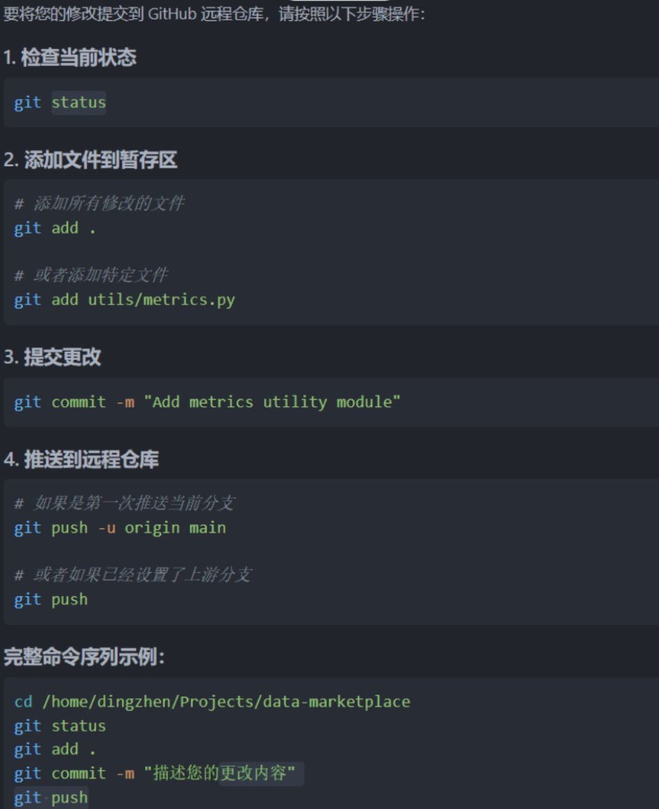
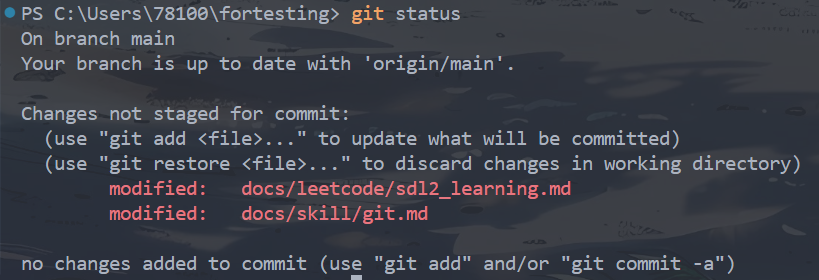

# Git
??? bug "`git_auto.py`脚本"
    **一份`git_auto.py`脚本实现自动拉取并提交**
    ```py
    import subprocess
    import sys

    def run_command_interactive(command):
        """执行需要交互输入的命令"""
        try:
            print(f"执行命令: {command}")
            result = subprocess.run(command, shell=True, text=True, encoding='utf-8')
            return result.returncode == 0
        except Exception as e:
            print(f"执行命令时出错: {e}")
            return False

    def run_command(command):
        """执行不需要交互的命令"""
        try:
            result = subprocess.run(command, shell=True, capture_output=True, text=True, encoding='utf-8')
            if result.returncode != 0:
                print(f"错误: {result.stderr}")
                return False
            if result.stdout.strip():
                print(result.stdout)
            return True
        except Exception as e:
            print(f"执行命令时出错: {e}")
            return False

    def main():
        print("=== Git 自动提交推送脚本 ===")
        
        # 获取提交信息
        commit_msg = input("请输入提交信息: ")
        if not commit_msg.strip():
            print("错误：提交信息不能为空！")
            return
        
        print("\n开始执行 Git 操作...")
        '''
        # 1. Git pull (需要交互输入密码)
        print("[1/4] 正在拉取远程更新...")
        print("可能需要输入 SSH 密钥的 passphrase...")
        if not run_command_interactive("git pull"):
            print("Git pull 失败！")
            return
        '''
        # 2. Git add .
        print("[2/4] 正在添加所有更改...")
        if not run_command("git add ."):
            print("Git add 失败！")
            return
        
        # 3. Git commit
        print("[3/4] 正在提交更改...")
        if not run_command(f'git commit -m "{commit_msg}"'):
            print("Git commit 失败或没有更改需要提交")
        
        # 4. Git push (可能也需要交互输入密码)
        print("[4/4] 正在推送到远程仓库...")
        # print("可能需要输入 SSH 密钥的 passphrase...")
        # if not run_command_interactive("git push"):  # 现在我已经做了ssh免密配置了
        if not run_command("git push"):
            print("Git push 失败！")
            return
        
        print("\n✅ 所有操作完成！")

    if __name__ == "__main__":
        main()
    ```

## example


很好！你已经在 GitHub 创建了仓库：[zhuiluozhiji/short-term-project](https://github.com/zhuiluozhiji/short-term-project)。接下来我们来**一步步指导你将本地项目结构搭建好并推送到该仓库中**，以便小组成员协作开发。


---


我们要将如下项目结构上传到该仓库中：

```
short-term-project/
├── README.md
├── requirements.txt
├── .gitignore
├── LICENSE
├── data/
├── models/
│   └── learner.py
├── market/
│   ├── auction.py
│   ├── pricing.py
│   └── revenue.py
├── utils/
│   └── metrics.py
└── main.py
```

---

###  1. 本地创建目录结构（命令行方式）

在你希望放置项目的目录下运行以下命令（推荐用终端或 WSL）：

```bash
# Step 1: 克隆远程仓库
git clone https://github.com/zhuiluozhiji/short-term-project.git
cd short-term-project

# Step 2: 创建目录结构
mkdir -p data models market utils

# Step 3: 创建初始化文件
touch README.md requirements.txt .gitignore LICENSE main.py
touch models/learner.py
touch market/auction.py market/pricing.py market/revenue.py
touch utils/metrics.py
```

> 📌 如果你是 Windows 用户，不用 WSL，也可以手动在资源管理器中创建这些目录和文件。

---


###  2. 提交并推送到 GitHub


首次推送时候的设置：
``` bash
# 改用 SSH 推送（高级用户）
git remote set-url origin git@github.com:zhuiluozhiji/short-term-project.git
```


如果已经添加过远程，运行前可以先用以下命令检查：

```bash
git remote -v
```


在 `short-term-project/` 目录下运行：

```bash
git add .
git commit -m "Initialize project structure and base files"
git push origin main
```

---

### 🧑‍🤝‍🧑 添加协作者（组员）

1. 打开 [仓库设置](https://github.com/zhuiluozhiji/short-term-project/settings)
2. 左侧菜单栏 → **Collaborators**
3. 搜索你组员的 GitHub 用户名 → 点击 “Add”

他们会收到一封邮件，接受邀请后就能协作开发了。

---

**后续建议**

| 模块      | 谁负责  | 建议分支名                     |
| ------- | ---- | ------------------------- |
| 数据模拟    | A 组员 | `feature/data-gen`        |
| 拍卖与机制设计 | B 组员 | `feature/auction`         |
| MWU定价   | C 组员 | `feature/mwu-pricing`     |
| 收益分配    | D 组员 | `feature/shapley-revenue` |

每人开发完 → Pull Request → 审核合并到 `main`。

---
!!! success
    **首次推送时候的设置：**
    ``` bash
    # 改用 SSH 推送（高级用户）
    git remote set-url origin git@github.com:zhuiluozhiji/short-term-project.git
    ```

    如果已经添加过远程，运行前可以先用以下命令检查：

    ```bash
    git remote -v
    ```

## 🧭 建仓库


## 之后的更改仅需要的操作


远程仓库 main 分支已经有提交（如：README.md），而你本地的 main 分支是空的或没有这些提交，所以你直接推送被拒绝了。

**✅ 解决方案：先拉取远程内容（合并或重建历史）
拉取远程并合并（推荐）
保持远程历史，适合你希望保留远程已有文件：**
``` bash
git pull --rebase origin main
git pull origin main
```




## 开发分支
查看历史提交,找到你要恢复的版本
```shell
git log --oneline
```
✅ 想创建新分支从旧版本开发
基于那个 commit 创建一个新分支
```shell
git checkout -b fix-from-old 4e5f6g7
# 创建一个新分支叫 fix-from-old,把你切换到这个旧版本上
#  -b 参数的作用是创建并切换到新分支。
```
强行回退到某个版本,会丢失未提交的更改
```shell
git reset --hard 4e5f6g7
```
在这个分支上修改和提交,推送你的分支到 GitHub远程
```shell
git push origin fix-from-old
```
改完后合并回主分支：
```bash
# 切换回主分支
git checkout main

# 拉取最新代码（确保干净）：
git pull origin main

# 合并你的新分支：(可能需要你手动操作合并选项)选蓝色/绿色模块
git merge fix-from-old

# 推送到 GitHub：
git push origin main
```


!!! question
    ```
    (data-marketplace) [dingzhen@77qq data-marketplace]$ git pull
    Enter passphrase for key : 
    There is no tracking information for the current branch.
    Please specify which branch you want to merge with.
    See git-pull(1) for details.

        git pull <remote> <branch>

    If you wish to set tracking information for this branch you can do so with:

        git branch --set-upstream-to=origin/<branch> fix-io-based-on-old
    ```
    你的 Git 报错说明：**你当前所在的分支 `fix-io-based-on-old` 没有设置上游（remote tracking）分支**，所以 Git 不知道该从哪个远程分支拉代码。

    ---

    - **💡 解决方法：设置远程跟踪分支**

    你只需要执行下面这条命令 **一次性绑定远程分支**，下次就能直接 `git pull` 了：

    ```bash
    git branch --set-upstream-to=origin/fix-io-based-on-old
    ```

    或者更明确地指定：

    ```bash
    git branch --set-upstream-to=origin/fix-io-based-on-old fix-io-based-on-old
    ```

    - **🛠️ 如果你刚创建并推送了该分支（推荐用法）**

    你可以也用这种一次性命令推送并建立 tracking：

    ```bash
    git push -u origin fix-io-based-on-old
    ```

    解释：

    * `-u`（或 `--set-upstream`）表示建立远程追踪关系
    * 之后就可以直接用 `git pull`、`git push`，不用再指定远程分支

    ---

    ✅ 之后你就可以正常使用：

    ```bash
    git pull
    git push
    ```


你不确定当前在哪个分支、工作区干不干净
```shell
git checkout 分支名 # 切换分支
git branch #查看所有本地分支
git status
```




---
