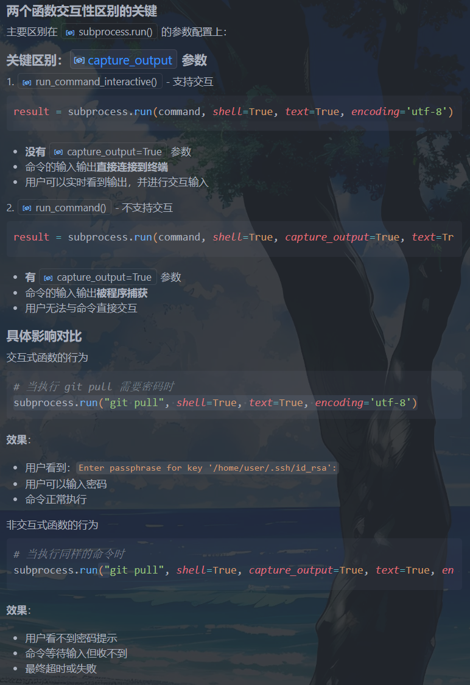

# 脚本
## shell
混个眼熟
### git自动提交推送
```shell
#!/bin/bash
# filepath: /home/man567/code/sfml-template/git_push.sh

# 提示用户输入提交信息
echo "请输入提交信息："
read commit_message

# 执行 Git 命令
git add .
git commit -m "$commit_message"
git push origin master

# 提示完成
echo "代码已成功提交并推送到远程仓库！"
```

### cmake自动编译运行
```shell
#!/bin/bash
# filepath: /home/man567/code/sfml-template/build_and_run.sh

# 切换到脚本所在目录（项目根目录）
cd "$(dirname "$0")"

# 创建并进入 build 目录
mkdir -p build
cd build

# 如果没有生成 Makefile，则运行 cmake
if [ ! -f Makefile ]; then
    cmake .. || { echo "CMake 配置失败！"; exit 1; }
fi

# 运行 make
make || { echo "编译失败！"; exit 1; }

# 提示编译完成
echo "编译完成！可执行文件位于 build/bin 目录中。"

cd .. # 切换到脚本所在目录，即项目根目录,避免load图片资源等相对路径错误
./build/bin/main
```

```shell
```


## windows: git提交推送脚本(.py)
```python
# git_auto.py
import subprocess
import sys

def run_command_interactive(command):
    """执行需要交互输入的命令"""
    try:
        print(f"执行命令: {command}")
        result = subprocess.run(command, shell=True, text=True, encoding='utf-8')
        return result.returncode == 0
    except Exception as e:
        print(f"执行命令时出错: {e}")
        return False

def run_command(command):
    """执行不需要交互的命令"""
    try:
        result = subprocess.run(command, shell=True, capture_output=True, text=True, encoding='utf-8')
        if result.returncode != 0:
            print(f"错误: {result.stderr}")
            return False
        if result.stdout.strip():
            print(result.stdout)
        return True
    except Exception as e:
        print(f"执行命令时出错: {e}")
        return False

def main():
    print("=== Git 自动提交推送脚本 ===")
    
    # 获取提交信息
    commit_msg = input("请输入提交信息: ")
    if not commit_msg.strip():
        print("错误：提交信息不能为空！")
        return
    
    print("\n开始执行 Git 操作...")
    
    # 1. Git pull (需要交互输入密码)
    print("[1/4] 正在拉取远程更新...")
    print("可能需要输入 SSH 密钥的 passphrase...")
    if not run_command_interactive("git pull"):
        print("Git pull 失败！")
        return
    
    # 2. Git add .
    print("[2/4] 正在添加所有更改...")
    if not run_command("git add ."):
        print("Git add 失败！")
        return
    
    # 3. Git commit
    print("[3/4] 正在提交更改...")
    if not run_command(f'git commit -m "{commit_msg}"'):
        print("Git commit 失败或没有更改需要提交")
    
    # 4. Git push (可能也需要交互输入密码)
    print("[4/4] 正在推送到远程仓库...")
    print("可能需要输入 SSH 密钥的 passphrase...")
    if not run_command_interactive("git push"):
        print("Git push 失败！")
        return
    
    print("\n✅ 所有操作完成！")

if __name__ == "__main__":
    main()
```

!!! danger "subprocess"


    Python 的标准库模块，用于执行系统命令和子进程。

    1. 导入模块 `import subprocess  # 导入整个模块`
    2. 使用模块中的函数 
        ```py
        subprocess.run()     # 执行命令
        subprocess.Popen()   # 创建子进程
        ```
    3. 用法
    ```py
    import subprocess

    # 基本用法
    result = subprocess.run("git status", shell=True)

    # 完整用法
    result = subprocess.run(
        command="git pull",
        shell=True, #在 shell 中执行 通过系统 shell（Windows 的 cmd 或 PowerShell）执行命令
        text=True, #一般就是true 以文本字符串形式处理输入输出，而不是字节
        encoding='utf-8', #字符编码 确保中文等非 ASCII 字符正确显示
        capture_output=True
    )
    ```
    4. 主要属性
    ```py
        result.returncode    # 退出状态码（0=成功，非0=失败）
        result.stdout        # 标准输出内容
        result.stderr        # 错误输出内容
        result.args          # 执行的命令参数
    ```

    若需要捕获输出执行：`capture_output=True`
    ```py
    import subprocess
    result = subprocess.run("git pull", shell=True, capture_output=True)
    print(result.stdout)  # 可以获取输出
    ```
    

    

- `strip()` 是 Python 字符串的方法，用于移除字符串两端的空白字符。
    ```py
    # 判断输出是否有实际内容
    if result.stdout.strip():
        print(result.stdout)
    ```


